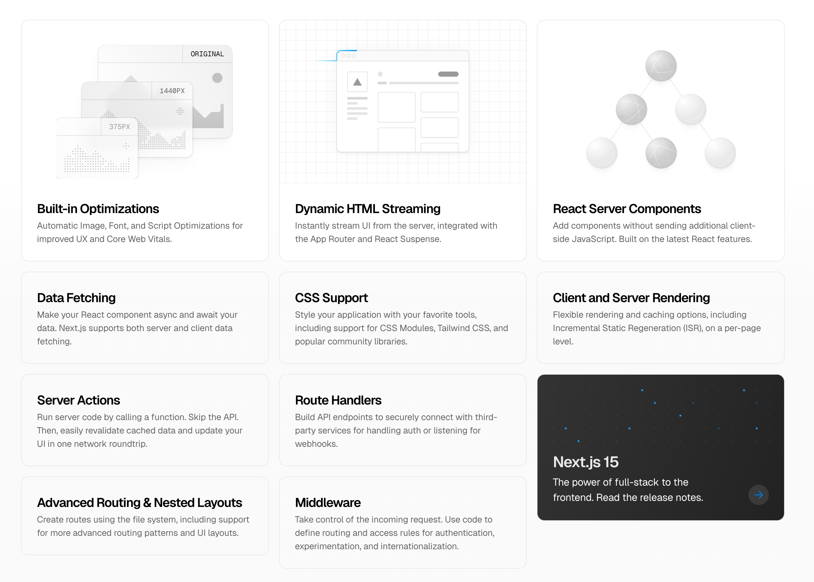

O *Next.js* é um frameworks para React focado em performance e facilidade para desenvolvimento.

Além de ser um **framework** que implementa as mais novas funcionalidades do React, o *Next.js* também traz uma coleção de componentes que permite, de forma fácil, que sua aplicação seja performática, acessível e use as melhores práticas.

## Quando a gente fala de Next.js, a gente fala do que?

- Roteamento baseado em arquivos;
- SSR - Renderização no Servidor (SSR é o principal mas podemos escolher outras formas)
- Backend + Frontend (para isso é necessário um servidor)
- Otimizações e performance
  - Imagens
  - Code Splitting
  - SEO
  - Carregamento rápido e boas métricas de performance
- E, a partir do Next.JS 13 - Server Components

## Funcionalidades segundo a Vercel

