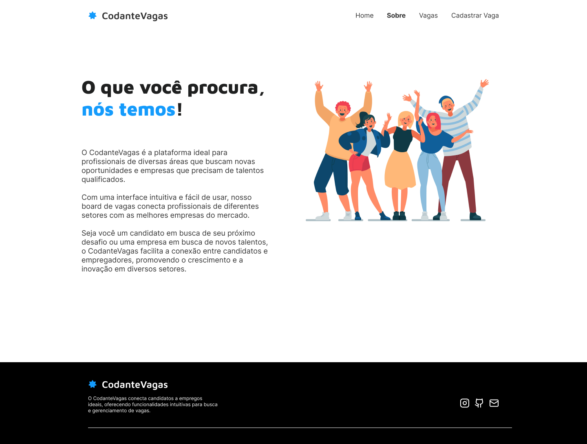
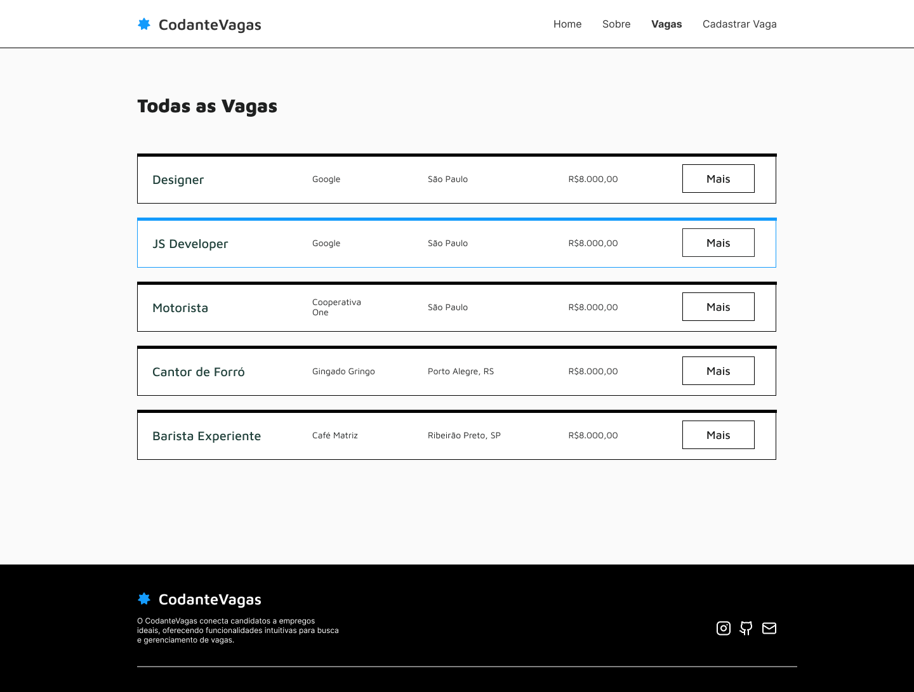
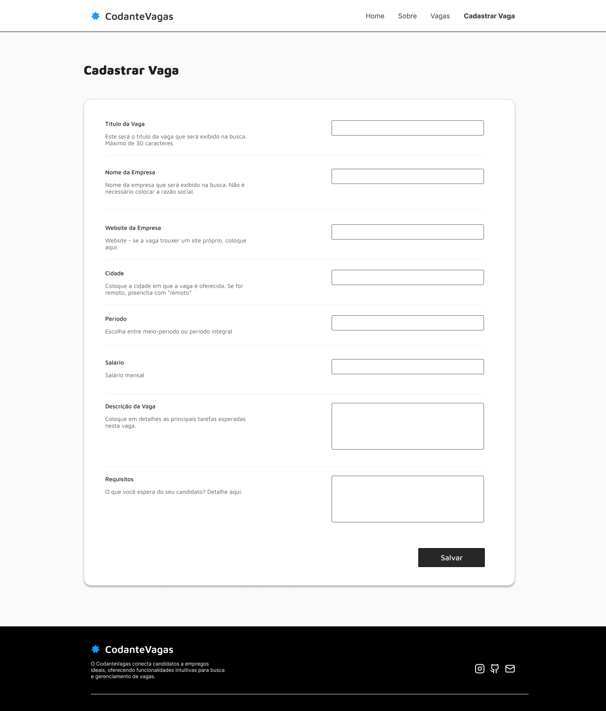
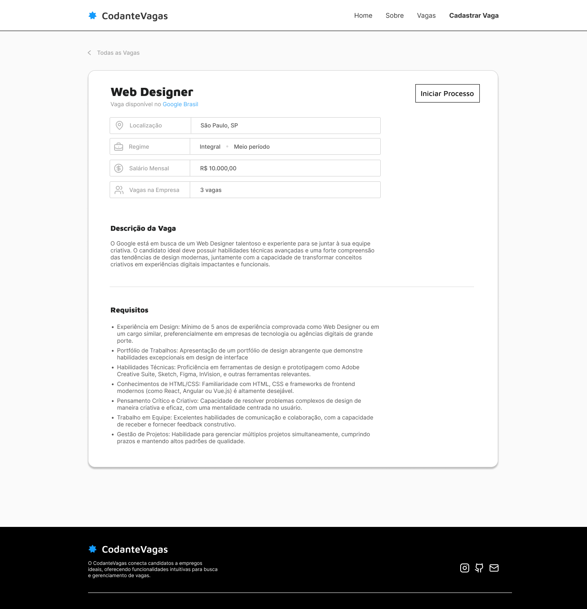
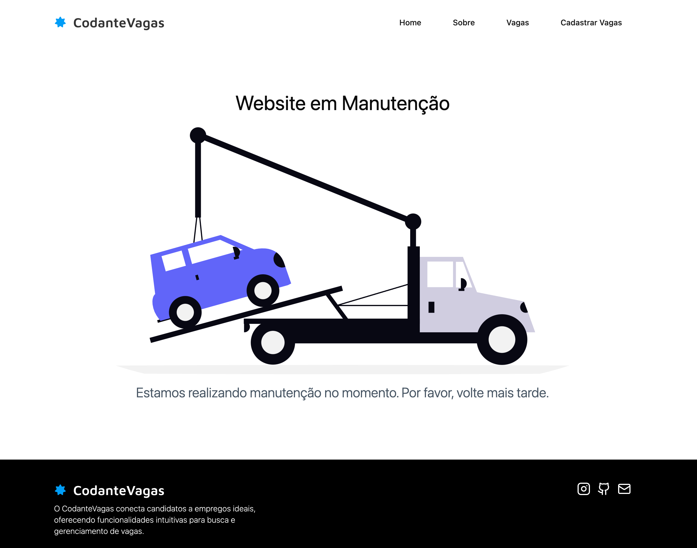
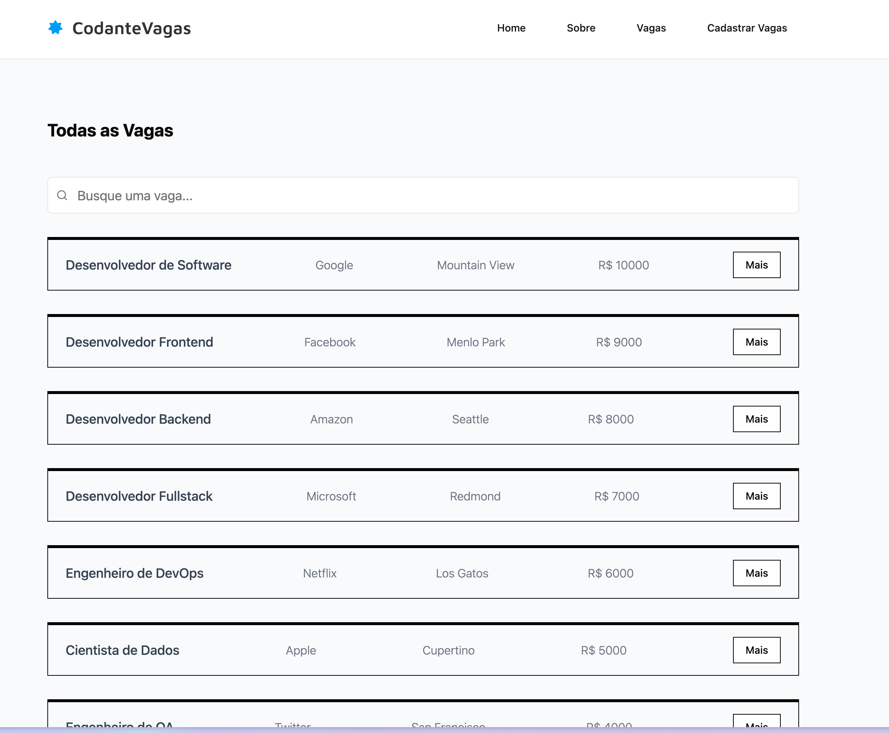
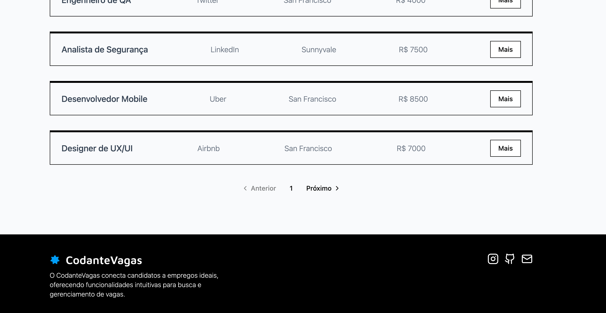

O CodanteVagas é um _job board_. Essa é uma aplicação em que um usuário é capaz de procurar vagas, cadastrar novas vagas e visualizar detalhes de vagas de emprego. Além de páginas estáticas `home` e `sobre`.

Construímos toda a aplicação no workshop passado. Neste workshop vamos incrementá-la com algumas funcionalidades mais avançadas.

## A aplicação inicial

Vamos mostrar aqui a **aplicação inicial** e a **aplicação final**.

### Home

Esta é a raiz da aplicação, a landing page. Note que há basicamente três seções (que continuam ao longo de toda a aplicação):

- Navbar
- Main
- Footer

### Sobre

Na página sobre, vamos entender na prática sobre o novo roteamento da pasta `app` do Next.js

### Busca de Vagas

Vamos para dados dinâmicos! Entender _data fetching_ com o Next.js, exibição de dados e, _quem sabe_, uma busca!

### Cadastro de Vagas

Esta seção trará tudo sobre Server Actions! Vamos fazer _mutação_ de dados de acordo com as melhores práticas e de forma moderna do React e deixando mais tênue a linha divisória entre _backend_ e _frontend_.

### Detalhes de Vaga

Aqui vamos deixar nossa aplicação mais funcional - nosso usuário precisa de mais informações sobre a vaga - e é isso que iremos trazer aqui.

## A aplicação final

### Middleware para página em manutenção

Vamos criar uma página para modo de manutenção que será controlada por um middleware:

### Loading States e Filtros

Vamos criar telas que respondem de forma mais rápida mesmo quando os dados demoram a chegar. Também vamos implementar filtro de busca

### Paginação

Também vamos implementar uma paginação

