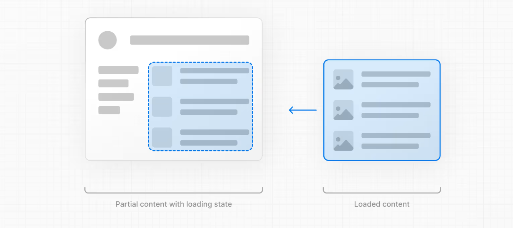

Agora que o padrão do Next.js é Server Rendering e Server Components, uma das partes cruciais é a "espera" por dados para a renderização da página.

### Por que a "espera" é crucial em SSR?

Server Side Rendering (SSR) é uma técnica de renderização em que o HTML é renderizado no servidor e a página servida já vem pronta. Essa estratégia contrapõe-se ao Client Side Rendering - em que o HTML vem vazio e o JS no browser do cliente é que irá montar a página.

Podemos dizer que o SSR tradicional usa uma estratégia de "tudo ou nada". Ou seja, ou você espera "tudo", ou você não tem "nada" na tela.

Então, os passos são os seguintes (e qualquer um deles pode atrasar o processo todo, especialmente o _data fetching_):

1. Servidor espera os dados
2. Servidor renderiza o HTML
3. HTML, CSS e JS são enviados para o cliente
4. Uma página inicial _não interativa_ é mostrada para o cliente
5. React faz o _hydration_

Ou seja, se o fetch de dados demorar, o usuário não irá ver nada até que eles tenham sido baixados pelo servidor.

### Qual a solução então?

A princípio, não havia solução (mas agora há!). Ou você usava SSR com esses pontos negativos, ou você usava Client Side Rendering - que tem uma série de outros pontos negativos também.

Agora, **entra o Streaming.**

Usar streaming com Next.js é vantajoso porque:

- **Melhora na experiência do usuário:** Evita que a página fique em branco enquanto os dados são carregados.
- **Performance:** Com streaming, partes da página podem ser renderizadas mais cedo.

### Streaming é a mesma coisa que Partial Prerendering?

Partial Prerendering foi introduzido no Next.js v14.

Não é a mesma coisa que streaming. A diferença fundamental é que, no Partial Prerendering (introduzido na v14), a renderização do HTML acontece no build time - e não no request time.

No momento deste workshop, Partial Prerendering ainda está em _beta_ e não está pronto para uso em produção.

### Como utilizar Streaming?

Existem duas formas de utilizar Streaming no Next.js quando utilizamos Server Components: usando o arquivo especial `loading.tsx` ou usando o componente `<Suspense>` do _React_.

#### Usando o `loading.tsx` (mais fácil)

Além de arquivos como `page.tsx` e `layout.tsx`, o Next.js também traz para nós, de graça, o `loading.tsx`. Esse arquivo especial (que sempre deverá possuir esse nome) **cria automaticamente uma UI com Suspense**.

Aqui é basicamente utilizar o arquivo especial `loading.tsx`. O que o loading faz, por trás dos panos, é envelopar a página em um `<Suspense>`.



Quando você usa o arquivo `loading`, algo como isso abaixo acontece:

```typescriptreact
<Suspense fallback={<Loading />}>
 <Page />
</Suspense>
```

:::tip

Veja que o `loading.tsx` funciona hierarquizado, da mesma forma que o `layout.tsx`. Ou seja, mesmo se você estiver trabalhando em uma página aninhada, o Next.js vai automaticamente procurar o `loading.tsx` no nível hierárquico superior mais próximo.

:::

Veja que **a UI do `loading.tsx` irá substituir completamente o conteúdo da página até que tudo tenha sido carregado**. Ou seja, só faz mesmo sentido se a página estiver dentro de um layout ou se você quiser um fallback para mostrar enquanto a tela não carrega.

#### Usando o `<Suspense>` (mais controle)

A segunda forma de fazer streaming é **você controlar** os limites do Suspense, envelopando as partes que quer usar especificamente o streaming. Basta usar o `<Suspense>` "embrulhando" o código que será "streamado" para o cliente - e que se tornará "não blocante".

Algo como:

```typescriptreact
<ComponenteEstatico />
<ComponenteEstatico2 />
<Suspense fallback={<Loading />}>
 <ListaDeUsuariosComFetchDeDados />
</Suspense>
<ComponenteEstatico3 />
```

No caso acima, o HTML dos componentes estáticos será rapidamente servido, já que não há fetch de dados. Enquanto a lista de usuários está carregando os dados, aparecerá uma _UI de loading_ apenas onde apareceriam os dados dinâmicos.

Tudo vai ficar muito mais inteligível na prática.
