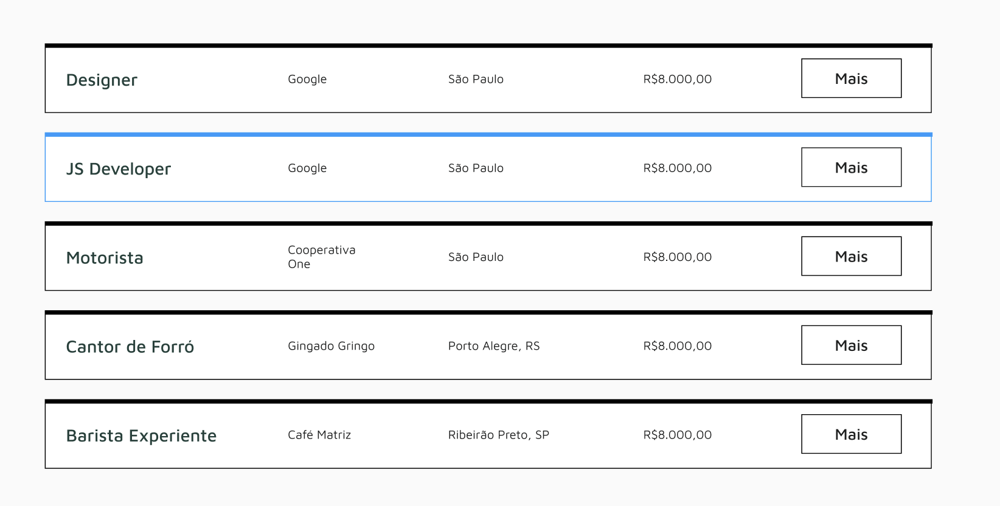

Vamos agora transpor do Figma para o HTML a página de vagas.

Atenção: Ainda não iremos buscar os dados da API - iremos ver *fetch de dados* mais para frente.

## Criando o componente `<JobItem>`

Vamos criar o componente Item de Vaga, que é esse card retangular que mostra um preview da vaga:



Vou criar uma pasta `cards` dentro da pasta `components`, onde irei colocar o `app/components/cards/job-item.tsx`.

Vamos importar esse componente para a página de todas as vagas.

### Código provisório do componente

```typescript
import { Button } from "../ui/button";

export default function JobItem() {
  return (
    <article className="flex w-full items-center justify-between border border-t-4 border-black px-6 py-4 transition-colors hover:border-blue-400">
      <h3 className="font-display text-lg font-medium text-gray-700">
        Designer
      </h3>
      <h4 className="font-light text-gray-500">Google</h4>
      <h4 className="font-light text-gray-500">São Paulo</h4>
      <h4 className="font-light text-gray-500">R$8.000,00</h4>
      <Button className="cursor-pointer" variant={"outline"}>
        Mais
      </Button>
    </article>
  );
}
```

### Código provisório da página `/vagas`

Também vamos colocar alguns desses componentes na página `vagas`:

```typescript
import JobItem from "@/components/cards/job-item";

export default function Vagas() {
  return (
    <main className="py-10">
      <h2 className="font-display mb-12 text-2xl font-bold">Todas as Vagas</h2>
      <div className="space-y-8">
        <JobItem />
        <JobItem />
        <JobItem />
        <JobItem />
      </div>
    </main>
  );
}

```
