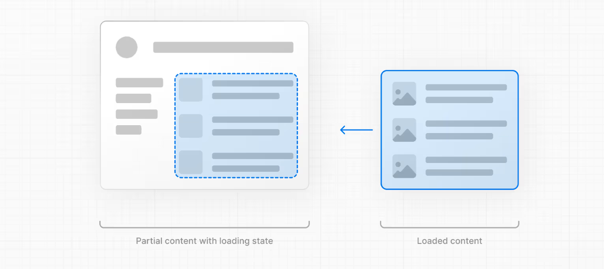

Agora que o padrão do Next.js é Server Rendering e Server Components uma das partes cruciais é a "espera" por dados para a renderização da página.

### Por que a "espera" é crucial em SSR?

Server Side Rendering (SSR) é uma técnica de renderização em que o HTML é renderizado no servidor e a página servida já vem pronta. Essa estratégia contrapõe ao Client Side Rendering - em que o HTML vem vazio e o JS no browser do cliente é que irá montar a página.

Podemos dizer que o SSR tradicional usa uma estratégia de "tudo ou nada". Ou seja, ou você espera "tudo", ou você não tem "nada" na tela.

Então, os passos são os seguintes (e qualquer um deles pode atrasar o processo todo, especialmente o _data fetching_.)

1. Servidor espera os dados
2. Servidor renderiza o HTML
3. HTML, CSS e JS é enviado para o cliente
4. Uma página inicial _não interativa_ é mostrada para o cliente
5. React faz o _hydration_

Ou seja, se o fetch de dados demora, o usuário não irá ver nada até que eles tenham sido baixados pelo servidor.

### Qual a solução então?

A princípio não havia solução (mas agora há!). Ou você usa SSR com esses pontos negativos ou você usa Client Side Rendering - que tem uma série de outros pontos negativos também.

Agora, **entra o Streaming.**

Usar streaming com Next.js é vantajoso porque:

- **Melhora na experiência do usuário:** Evita que a página fique em branco enquanto os dados são carregados.
- **Performance:** Com streaming, partes da página podem ser renderizadas mais cedo.

### Streaming é a mesma coisa que Partial Prerendering?

Partial Prerendering foi introduzido no Next.js v14.

Não é a mesma coisa que streaming. A diferença fundamental é que no Partial Prerendering (introduzido na v14) a renderização do HTML acontece no build time - e não no request time.

No momento desse workshop Partial Prerendering ainda está em _beta_ e não está pronto para uso em produção.

### Como utilizar Streaming?

Existem duas formas de utilizar Streaming no Next.js quando utilizamos Server Components.

- A primeira - e mais simples - é basicamente utilizar o arquivo especial `loading.tsx`. Basicamente o que o loading faz é envelopar a página em um `<Suspense>`

Quando você usa o arquivo `loading` algo como isso abaixo acontece:

```typescriptreact
<Suspense fallback={<Loading />}>
  <Page />
</Suspense>
```

:::tip
Veja que o `loading.tsx` funciona hierarquizado da mesma forma que o `layout.tsx`. Ou seja, mesmo se você estiver trabalhando em uma página aninhada, o Next.js vai automaticamente procurar o `loading.tsx` no nível hierárquico superior mais próximo.
:::

- A segunda é **você controlar** os limites do Suspense, envelopando as partes que quer usar especificamente o streaming. Basta usar o `<Suspense>` "embrulhando" o código que será "streamado" para o cliente - e que se tornará "não blocante".

### Utilizando o `loading.tsx`

Além de arquivos como o `page.tsx`, `layout.tsx`, o Next.js também traz para nós, de graça, o `loading.tsx`. Esse arquivo especial (que sempre deverá possuir esse nome) **cria automaticamente uma UI com Suspense**.



Veja que essa UI irá substituir completamente o conteúdo da página até que tudo tenha sido carregado.
