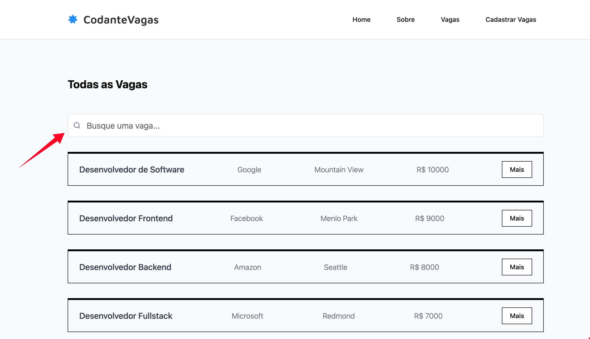

A primeira coisa que iremos implementar é uma **busca textual**. Ela deverá ser em "tempo real", isto é, os itens deverão aparecer na tela sem a necessidade de submeter um formulário ou clicar em um botão.

## Exercício 01 - Crie a UI da Busca

Você deverá criar uma UI como essa abaixo:



Apenas a UI é necessária. A implementação iremos fazer posteriormente.

:::tip
Já que estamos usando `TailwindCSS` e `shadcn/ui` para os componentes, podemos utilizar o componente `Input` do `shadcn/ui` que já possuímos.
:::

### Resolução - UI da Busca

Vamos adicionar mais uma funcionalidade no `Input`: a possibilidade de passarmos um ícone para que seja exibido à esquerda. Para isso, vamos mudar o componente `components/ui/input.tsx`:

O código final do `Input` será esse:

```typescript
// components/ui/input.tsx
import * as React from 'react';
import { cn } from '@/lib/utils';

export interface InputProps
  extends React.InputHTMLAttributes<HTMLInputElement> {
  icon?: React.ReactNode;
  ref?: React.Ref<HTMLInputElement>;
}

function Input({ className, type, icon, ref, ...props }: InputProps) {
  return (
    <div className="relative">
      <input
        ref={ref}
        type={type}
        className={cn(
          'border-input bg-background ring-offset-background placeholder:text-muted-foreground focus-visible:ring-ring flex h-10 w-full rounded-md border px-3 py-2 text-sm file:border-0 file:bg-transparent file:text-sm file:font-medium focus-visible:ring-2 focus-visible:ring-offset-2 focus-visible:outline-none disabled:cursor-not-allowed disabled:opacity-50',
          icon && 'pl-10',
          className
        )}
        {...props}
      />
      {icon && (
        <span className="absolute top-1/2 left-3 -translate-y-1/2 text-gray-500">
          {icon}
        </span>
      )}
    </div>
  );
}

Input.displayName = 'Input';

export { Input };
```

Vamos agora utilizar esse input em nossa página de vagas:

```typescript
// app/vagas/page.tsx
import { Input } from '@/components/ui/input';
import { Search } from 'lucide-react';
import { Suspense } from 'react';
import JobsList from './jobs-list';

export default async function Vagas() {
  return (
    <main className="py-10">
      <h2 className="font-display mb-12 text-2xl font-bold">Todas as Vagas</h2>
      <div className="mb-8">
        <Input
          type="search"
          placeholder="Busque uma vaga..."
          className="py-6 text-lg"
          icon={<Search className="size-4" />}
        />
      </div>
      <Suspense fallback={<div>loading...</div>}>
        <JobsList />
      </Suspense>
    </main>
  );
}
```

---

## Exercício 02 - Estado na URL

Agora está na hora de começarmos a adicionar a funcionalidade principal.
Nesse momento, o primeiro passo é refletir o termo de busca em nossa URL. Não se preocupe em exibir os resultados corretos da API. Neste momento, queremos apenas "transferir" o valor do input para a nossa URL.

Também queremos fazer _o caminho inverso_: quando acessarmos uma URL com um parâmetro de `search` já predefinido, o input deverá exibir o valor dentro da caixa de texto.

### Resolução - Estado na URL

Para cada tecla digitada devemos chamar nossa API. Isso significa que devemos "escutar" o evento `onChange`. Um primeiro problema está no fato de que não conseguimos utilizar um _event listener_ em server components.

Para isso precisamos extrair nossa busca para um componente à parte e usar a diretiva `use client`.

Em segundo lugar, precisamos capturar o valor do input para transferir para a URL.

```typescript
// app/vagas/_components/search-bar.tsx
'use client';
import { Input } from '@/components/ui/input';
import { Search } from 'lucide-react';
import { useRouter, useSearchParams } from 'next/navigation';

export default function SearchBar() {
  const searchParams = useSearchParams();
  const previousSearchText = searchParams?.get('search') || '';
  const router = useRouter();

  function handleChange(event: React.ChangeEvent<HTMLInputElement>) {
    const urlSearchParams = new URLSearchParams(searchParams ?? undefined);
    const searchText = event.currentTarget.value;

    if (searchText) {
      urlSearchParams.set('search', searchText);
    } else {
      urlSearchParams.delete('search');
    }

    router.replace('?' + urlSearchParams.toString());
  }

  return (
    <div className="mb-8">
      <Input
        type="search"
        placeholder="Busque uma vaga..."
        className="py-6 text-lg"
        icon={<Search className="size-4" />}
        onChange={handleChange}
        defaultValue={previousSearchText}
      />
    </div>
  );
}
```

---

## Exercício 03 - Utilizando o termo de busca para atualizar os resultados da API

Agora é a hora de implementarmos a busca no nível da API. Quando nossa URL é atualizada, queremos fazer uma nova chamada à nossa API para que os termos sejam filtrados em nível server-side.

### Resolução

Em linhas simples o que precisamos fazer:

1. Buscar os parâmetros da URL
2. Se houver o parâmetro `search`, devemos capturá-lo
3. Devemos fazer uma chamada à nossa API, agora usando o parâmetro `search`.

Em primeiro lugar, para deixar tudo mais _clean_, vamos extrair também a listagem de vagas para um componente `job-list.tsx`.

Depois, vamos usar os parâmetros que estão na página para fazermos o fetch de nossa API.

```typescript
// vagas/jobs-list.tsx
import JobItem from '@/components/cards/job-item';
import { Job } from '@/lib/types';

async function fetchJobs(searchString: string) {
  const params = new URLSearchParams();
  if (searchString) {
    params.set('search', searchString);
  }

  const res = await fetch(
    `https://apis.codante.io/api/job-board/jobs?${params.toString()}`,
    {
      cache: 'no-store',
    }
  );

  if (!res.ok) {
    throw new Error('Ops, alguma coisa deu errada!');
  }

  const json = await res.json();
  const jobs: Job[] = json.data;
  return jobs;
}

export default async function JobsList({
  searchParams,
}: {
  searchParams: Promise<{ [key: string]: string | string[] | undefined }>;
}) {
  const resolvedSearchParams = await searchParams;
  const searchString = resolvedSearchParams.search as string;

  const jobs = await fetchJobs(searchString);

  return (
    <div className="space-y-8">
      {jobs.map((job) => (
        <JobItem key={job.id} job={job} />
      ))}
    </div>
  );
}
```

Nossa página principal ficou bastante limpa:

```typescript
// app/vagas/page.tsx
import SearchBar from './_components/search-bar';
import JobsList from './jobs-list';

export default async function Vagas({
  searchParams,
}: {
  searchParams: Promise<{ [key: string]: string | string[] | undefined }>;
}) {
  return (
    <main className="py-10">
      <h2 className="font-display mb-12 text-2xl font-bold">Todas as Vagas</h2>
      <SearchBar />
      <JobsList searchParams={searchParams} />
    </main>
  );
}
```

---

## Exercício 4 - Debounce no Input

Perceba que não é muito performático fazer uma chamada API para cada letra que é digitada no nosso input. A solução para isso é usar uma técnica/função chamada `debounce`.

:::tip
Uma biblioteca famosa é o `use-debounce`. Utilize ela para facilitar a implementação
:::

### Resolução - Debounce

Primeiro vamos instalar a biblioteca `use-debouce`. Se houver alguma dúvida, basta olhar a [documentação](https://github.com/xnimorz/use-debounce#readme).

Vamos simplesmente trocar o handleChange por um `debouncedHandleChange`:

```typescript
'use client';
import { Input } from '@/components/ui/input';
import { Search } from 'lucide-react';
import { useRouter, useSearchParams } from 'next/navigation';
import { useDebouncedCallback } from 'use-debounce';

export default function SearchBar() {
  const searchParams = useSearchParams();
  const previousSearchText = searchParams?.get('search') || '';
  const router = useRouter();

  function handleChange(event: React.ChangeEvent<HTMLInputElement>) {
    const urlSearchParams = new URLSearchParams(searchParams ?? undefined);
    const searchText = event.target.value;

    if (searchText) {
      urlSearchParams.set('search', searchText);
    } else {
      urlSearchParams.delete('search');
    }

    router.replace('?' + urlSearchParams.toString());
  }

  const debouncedHandleChange = useDebouncedCallback(handleChange, 500);

  return (
    <div className="mb-8">
      <Input
        type="search"
        placeholder="Busque uma vaga..."
        className="py-6 text-lg"
        icon={<Search className="size-4" />}
        onChange={debouncedHandleChange}
        defaultValue={previousSearchText}
      />
    </div>
  );
}
```

Agora, as chamadas à API vão ocorrer, no máximo, a cada 500ms!
