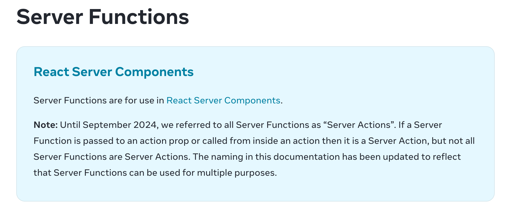

## Server Actions ou Server Functions?

Até Setembro de 2024, não havia distinção entre **Server Actions** e **Server Functions**. Ambos eram chamados de **Server Actions**.

A partir dessa data criou-se a distinção entre os dois.

## Server Functions

### Definição de Server Function

Uma **server function** é:

- uma função assíncrona
- definida pela diretiva `use server`
- definida no lado do servidor
  - inline em um server component com a diretiva `use server` no início da função
  - em um arquivo separado com a diretiva `use server` no topo do arquivo
- que pode ser utilizada tanto em *client components* quanto em *server components*

### Chamando uma Server Function

Uma server function pode ser chamada no cliente ou no servidor. Mas não faz muito sentido chamá-la no servidor, já que no servidor você pode usar a lógica diretamente no componente sem precisar de uma função separada.

#### Chamando no Cliente

Você pode invocar uma Server Function:

- em um formulário (ela receberá o objeto `formData` como argumento)
- em um event handler.

## Server Action

### Definição de Server Action

Uma **server action** é:

- uma **Server Function**
- que é chamada diretamente em um `form` ou;
- chamada dentro de uma `action` de um `form`

Quando a server action é chamada em um `form`, ela recebe o objeto `formData` como primeiro argumento.
