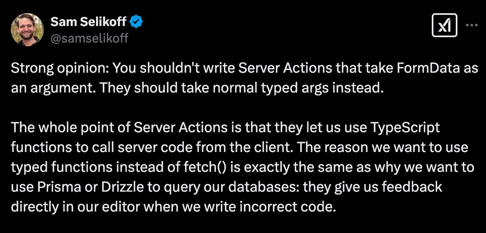

## Invocando Server Functions dentro e fora de um formulário

Quando uma Server Function é chamada em um formulário algumas coisas "mágicas" acontecem:

1. Um objeto `formData` é passado como primeiro argumento (assinatura da Server Action muda)
2. A função é automaticamente envelopada em uma `transition`

## Diferentes maneiras de passar argumentos para uma Server Function / Action

Muitas vezes quando criamos uma Server Action, queremos passar argumentos adicionais para ela (além do *formData*). Vamos ver como fazer isso?

1. *[Form + Action]* Passando apenas o *formData* e passando argumentos adicionais em `input:hidden`
2. *[Form + Action]* Automaticamente passando *formData* + argumentos adicionais
3. *[Form + Action]* Passando apenas o *formData* + fazendo o bind de argumentos adicionais - nesse caso o argumento adicional vem *antes* do *formData*.
4. *[Form + Event Handler]* Usar a action em um event handler como `handleSubmit` ao invés de em uma `action`. Fazer o parse manual do *formData* no front e passar apenas argumentos (nesse caso o formData não será passado)

## Exercício

Para esse exercício, vamos treinar todas as maneiras de passar argumentos para a nossa Server Action. Lembrando que o argumento que precisamos passar é o *id* da vaga para que ela possa ser deletada com nossa API.

### Resolução

Experimente "brincar" com as diferentes formas de passar argumento para a server action `deleteJob`.

## Hot Take / Controvérsia

O que você acha [desse tweet](https://x.com/samselikoff/status/1883173668135575668)? Consegue entender a controvérsia?

