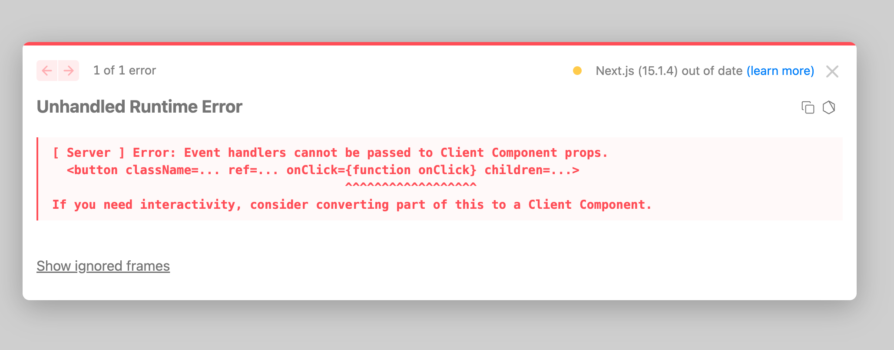
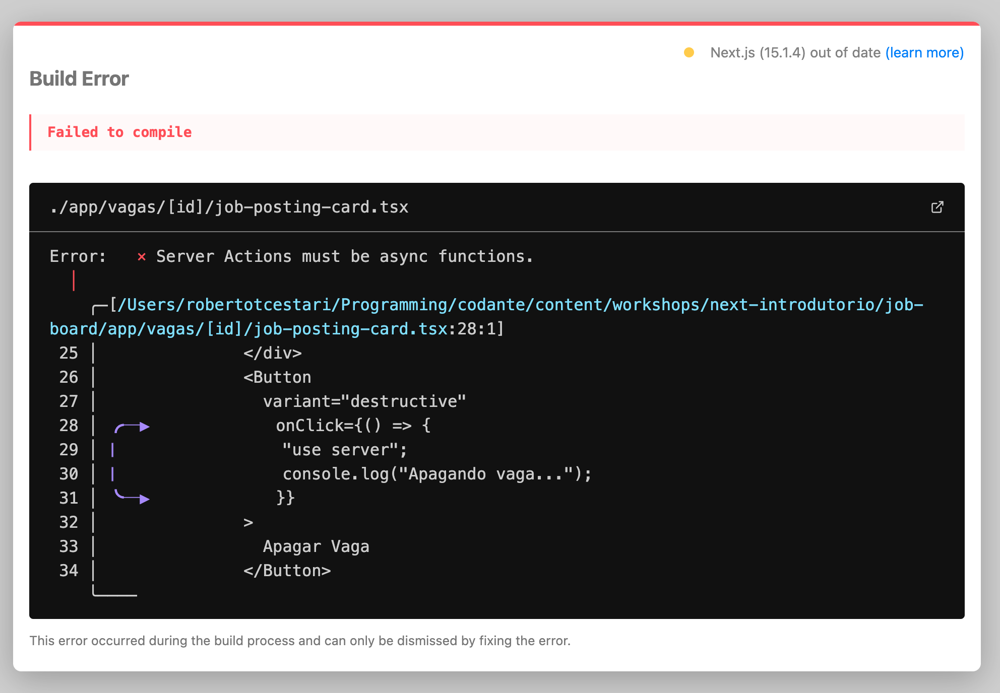

Até agora fizemos *fetch* de dados, ou seja, apenas exibimos/lemos dados. Para isso, podemos usar qualquer função de fetch ou biblioteca (como axios).

Agora, vamos começar a fazer a *mutação* de dados. Vamos fazer essa mutação de duas formas:

1. Apagando uma vaga
2. Incluindo uma nova vaga

Em primeiro lugar, vamos entender melhor o que são Server Actions.

## O que são Server Actions?

As Server Actions são funções assíncronas executadas no servidor, introduzidas no React e integradas ao Next.js.

Elas representam uma nova forma para lidar com submissões de formulários e mutações de dados. As Server Actions **podem ser chamadas tanto em Componentes de Servidor quanto em Componentes de Cliente**, oferecendo uma maneira mais direta e eficiente de realizar operações no lado do servidor.

Para utilizar Server Actions, devemos adicionar uma diretiva `"use server"` no topo de uma função assíncrona ou no início de um arquivo separado para marcar todas as exportações desse arquivo como Server Actions.

## Criando uma action "inline"

No nosso componente `JobPostingCard` temos um botão de deletar a postagem.

### Exercício 01

Tente colocar um `console.log` inline ao clicar neste botão que mostre a mensagem: `"apagando vaga..."`.

### Resolução do Exercício 01

Agora com RSC, não é mais tão banal fazermos interatividade.

Vamos tentar adicionar o `console.log`:

```typescript title="app/vagas/[id]/page.tsx" ins={3-5}
<Button
  variant="destructive"
  onClick={() => {
    console.log("Apagando vaga...");
  }}
>
  Apagar Vaga
</Button>
```

O que acontece? O erro abaixo:



Esse erro nada mais está dizendo que estamos tentando colocar event handlers em componentes de cliente! Lembra das regras dos RSC? Como, por padrão todos os componentes são de servidor, esse também é um componente de servidor então ele não suporta *event handlers* como o React comum.

Temos duas soluções para isso:

1. Converter o componente para *client component*
2. Passar uma server action para o *onClick* deste componente.

Para converter o componente para cliente, basta colocarmos uma diretiva `use client` no topo do arquivo.

Fazendo isso, o erro desaparece. Mas não é isso que queremos nesse caso. Vamos manter o componente como cliente e vamos colocar a diretiva `use server` na função que passamos para o `onClick`:

```typescript title="app/vagas/[id]/page.tsx" ins={4}
<Button
  variant="destructive"
  onClick={() => {
    "use server";
    console.log("Apagando vaga...");
  }}
>
  Apagar Vaga
</Button>
```

Agora temos outro erro:



Precisamos transformar essa função em função assíncrona também:

```diff lang="typescript" title="app/vagas/[id]/page.tsx"
<Button
  variant="destructive"
-  onClick={() => {
+  onClick={async () => {
    "use server";
    console.log("Apagando vaga...");
  }}
>
  Apagar Vaga
</Button>
```

Pronto! Tudo está funcionando!

Mas uma coisa interessante aconteceu: nenhum console.log é mostrado no nosso navegador. E isso é exatamente o que esperamos. As server actions não rodam no cliente, mas sim diretamente no servidor. Você verá o console no seu terminal que está rodando a aplicação - e não no navegador.
