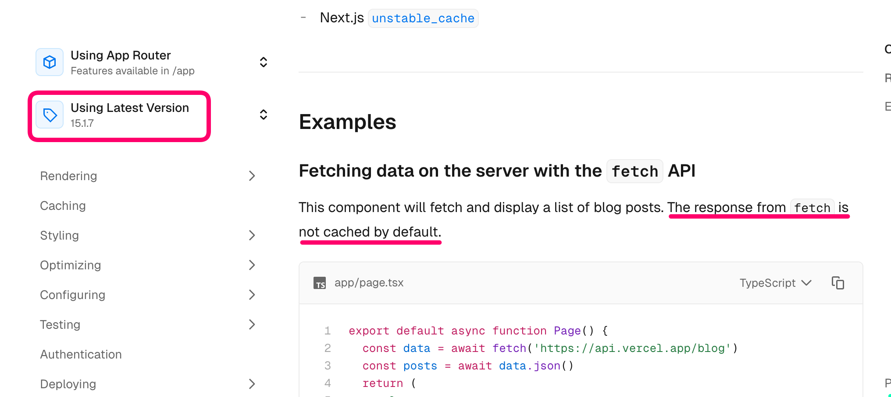
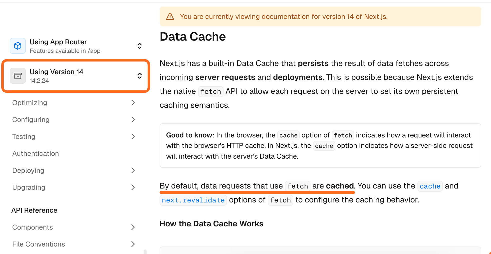

Por mais existam configurações avançadas de cache, o assunto na verdade é mais fácil do que pode parecer.

Quando discutimos *cache* no Next.js, é importante especificar a que tipo de cache estamos nos referindo. Isso porque não há apenas um cache, mas quatro caches diferentes:

1. **[React]** Cache de múltiplos fetches idênticos na renderização
2. **[Next]** Cache completo de rota (*página estática vs dinâmica*)
3. **[Next]** Cache de dados do fetch
4. **[Next]** Cache do client router

## 1. Cache do React em múltiplos Fetches

O primeiro é o *cache do react*. A gente não precisa prestar muita atenção nele porque ele é feito automaticamente pelo React e praticamente não existe como configurá-lo (e nem é recomendado).

Em uma página React, é possível que vários componentes diferente façam fetch para o mesmo endpoint (por exemplo, para pegar dados do usuário).

Ao invés de fazer vários fetches para o mesmo endpoint recebendo a mesma resposta, o React (e não o Next) automaticamente faz o cache do primeiro - e apenas um fetch request é feito.

- Só é aplicado em GET requests usando fetch (ou usando a função `cache` do React)
- Só funciona em uma árvore React - não funciona em rotas API
- É efêmero - dura apenas uma renderização. Quando os componentes forem renderizados, o cache é descartado.

## 2. Cache de Rotas

A primeira coisa que precisamos deixar nítido é que o Next sempre foi um "gerador-de-site-estático-first" 😶.

Ou seja, o padrão é gerar **páginas estáticas prontas em HTML**. E quando alguém acessar sua aplicação, o servidor (ou CDN) irá servir a página pronta HTML. Isso é muito rápido 🚄

Existem duas formas de renderizar páginas no Next.js (a terceira ainda está em desenvolvimento). Uma página/rota pode ser:

- **Estática** (cache do HTML, HTML é criado no *build time*)
- **Dinâmica** (sem cache, HTML é criado em *request time*)
- **Estática Parcialmente**  (canary, portanto não iremos nos adentrar)

E muito importante já colocarmos um grande aviso de cuidado:

:::caution
O comportamento é totalmente diferente quando você está usando o `dev server` vs quando está usando um `production build`. O dev server **não faz o cache**, o que pode confundir as coisas!
:::

### O que define como será a renderização página?

E como fazer com que uma rota seja estática ou dinâmica? Para ser estática, não precisa fazer nada - ela por padrão é.

Vamos ver como faz para uma rota ser dinâmica:

0. Por padrão tudo começa estático.
1. Se o Next.js "perceber" que você quer que a página seja dinâmica, ela será dinâmica:
   1. Se você usar `cookies()` ou `headers()` ou `connection()`;
   2. Ou se você usar a prop `searchParams`
   3. Ou se no `fetch` de dados, você usar o `cache` `no-store`
2. Se você dizer explicitamente para o next que quer que a página seja dinâmica através do código:

  ```typescript
  export const dynamic = "force-dynamic";
  ```

### Quando usar um ou outro?

- Se você não precisa de dados dinâmicos (o exemplo clássico é um blog), use rotas estáticas.
- Se você precisa de dados dinâmicos você precisará de rotas dinâmicas.

## 3. Cache de dados do fetch

- Persiste por requests
- Persiste por deployments
- Opção `cache` "force-cache" ou "no-store"
- Se for cached:
  - Time based ou On demand

--- Fazer exemplo com [iss location](http://api.open-notify.org/iss-now.json)

## 4. Cache de client-side router

Quando você navega entre links dentro da sua aplicação (usando o componente `next/link`), a navegação é feita *client-side*, ou seja, não é necessário um reload completo da página.

Além disso, também é feito um *prefetch* de dados, ou seja, no *background*, os dados da página de destino são baixados assim que o `link` entra no *viewport*.

Quando um usuário navega para outra rota na aplicação, o Next.js pode fazer o cache *client-side* dessas rotas. A partir da v15 isso não acontece mais por padrão.

Por essa razão, não precisamos dar muita atenção a esse cache - porque raramente iremos ajustar alguma coisa aqui.

<https://x.com/asidorenko_/status/1794409654740799636>

## Alterações no Next.js 15

O comportamento do cache se alterou de duas formas a partir do Next.js 15:

1. Em rotas API, as funções GET eram cacheadas por padrão. Agora não mais.
2. O cache de client-side router não mais é habilitado por padrão - exceto para navegação back/forward do navegador.
3. O fetch não é mais cacheado por padrão.



