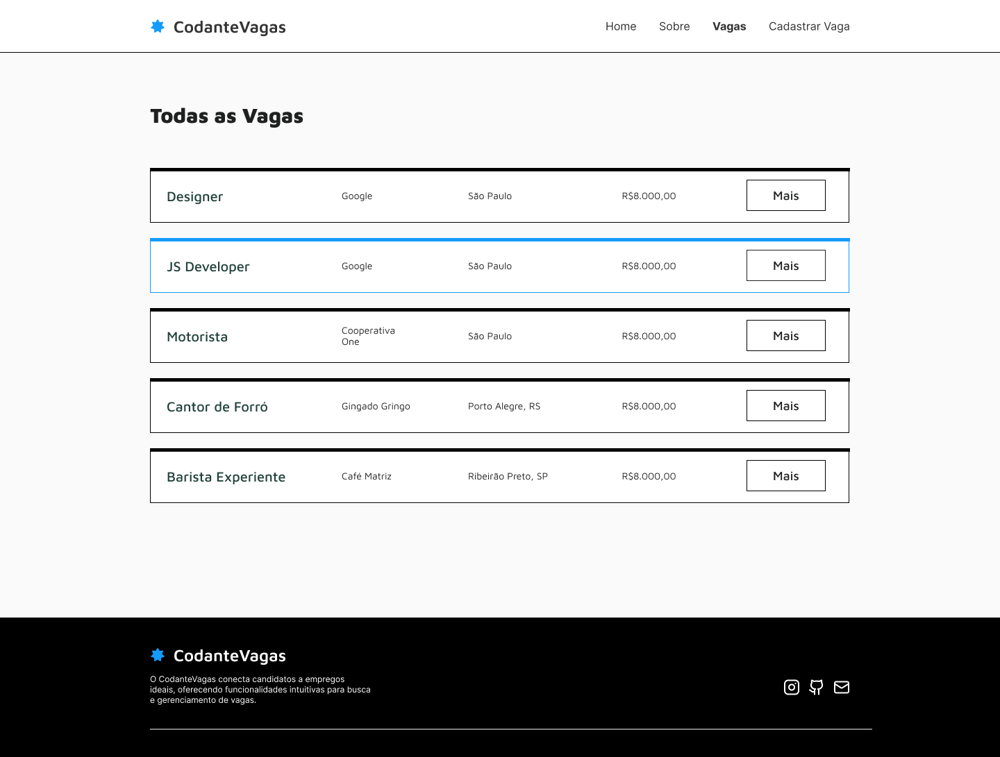
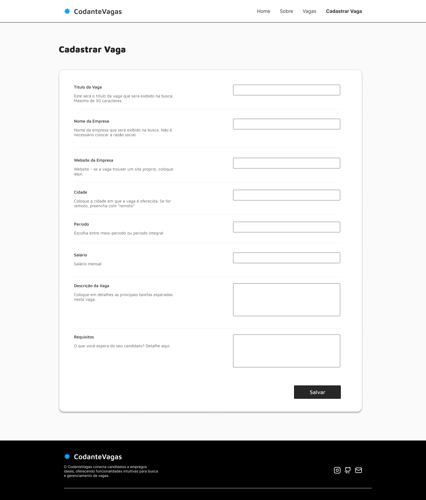

Vamos criar um *job board*. Essa será uma aplicação em que um usuário será capaz de procurar vagas, cadastrar novas vagas e visualizar detalhes de vagas de emprego. Além de páginas estáticas `home` e `sobre`. 

## Protótipos

É mais fácil entender com os protótipos:

### Home

Esta é a raiz da aplicação, a landing page. Note que há basicamente três seções (que continuam ao longo de toda a aplicação):

- Navbar
- Main
- Footer

### Sobre

Na página sobre, vamos entender na prática sobre o novo roteamento da pasta `app` do Next.js

### Busca de Vagas

Vamos para dados dinâmicos! Entender *data fetching* com o Next.js, exibição de dados e, *quem sabe*, uma busca!

### Cadastro de Vagas

Esta seção trará tudo sobre Server Actions! Vamos fazer *mutação* de dados de acordo com as melhores práticas e de forma moderna do React e deixando mais tênue a linha divisória entre *backend* e *frontend*.

### Detalhes de Vaga

Aqui vamos deixar nossa aplicação mais funcional - nosso usuário precisa de mais informações sobre a vaga - e é isso que iremos trazer aqui. 

