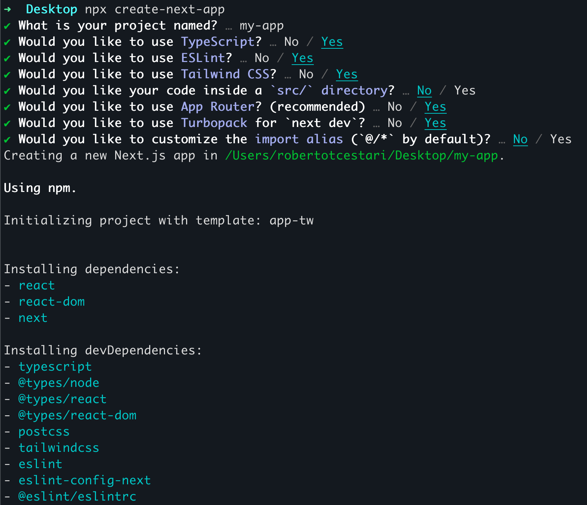

Então o primeiro passo para construirmos o CodanteVagas é criarmos nosso projeto Next.js

:::note
Vamos começar a perceber que um dos pilares do Next.js é a simplificação da DX (dev experience). Geralmente comandos simples no Next fazem *muita coisa* por baixo dos panos.
:::

Vamos rodar o comando:

```bash
npx create-next-app
```

Agora basta seguir os passos da tela.

Se quiser saber mais sobre o `create-next-app` - e as possibilidades de configuração, dá uma olhadinha no [README do pacote](https://github.com/vercel/next.js/blob/canary/packages/create-next-app/README.md) .

Os passos são esses:



Vamos atualizar com o nome do nosso projeto e *voilá*, temos um novo projeto Next.js.

Agora, o próximo passo é explorar o que um projeto novo traz para nós.
