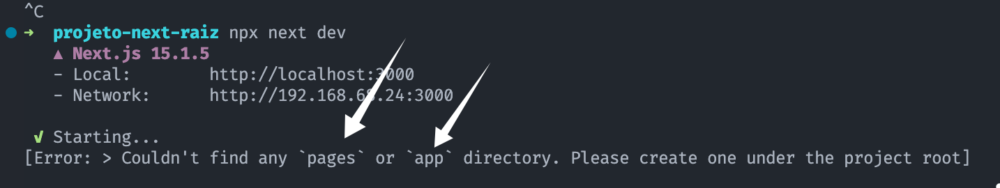

O Next.js é uma biblioteca javascript como qualquer outra. Isso significa que, para trabalhar com ela, não necessariamente precisamos criar um projeto com o `npx create-next-app`. Basta adicionarmos o `next` como uma dependência padrão de nosso projeto javascript.

Ou, em outras palavras, podemos usar o `next` no "modo raiz".

Quer ver um exemplo rápido.

1. Vamos criar um projeto novo do zero com `npm init -y`.
2. Vamos adicionar as dependências `next`, `react` e `react-dom`.
3. Maravilha, nosso projeto está com Next.js.
4. Para rodar, basta rodarmos o `npx next dev`.

    Temos um problema. haverá um erro:

    

    Isso porque, para funcionar o Next.js precisa de uma pasta `app`, ou, se usarmos o Next antigo (antes da versão 13), a pasta `pages`.

5. Vamos criar a pasta `app`
6. Maravilha, agora tudo está rodando, mas não temos página nenhuma.
7. Vamos criar uma `page.tsx` com um `hello world`.
8. Automaticamente o dev server cria pra gente uma pasta `.next`, um arquivo `layout.tsx` e um arquivo `tsconfig.json`. Mágico!

Pronto, isso tudo é o que precisa para rodarmos um projeto mínimo do Next.js.
