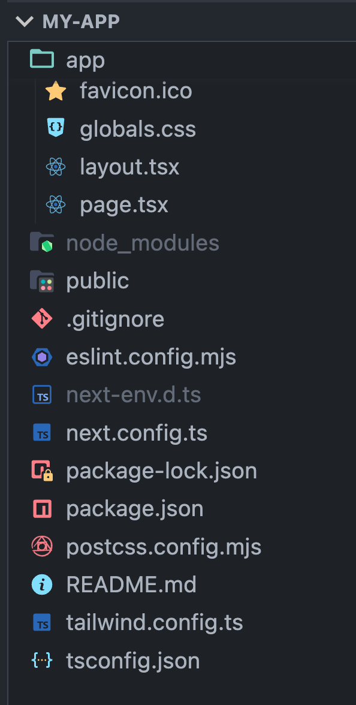

No momento de gravação desse Workshop, a estrutura de pastas de um projeto Next.js é bastante simples e é a seguinte:

Veja que não há muito segredo em relação às pastas. Temos apenas duas: a `public` e a `app`.

## A pasta `public`

Em linhas simples: a pasta public é onde ficam arquivos estáticos. Todos os arquivos aqui (i.) serão públicos; (ii.) terão uma rota e (iii.) serão acessíveis diretamente do navegador.

Por exemplo, se você tiver um arquivo JSON em `public/data.json`, ele será acessível em `http://localhost:3000/data.json`.

## A pasta `app`

Essa é a pasta especial e a "mais importante" de um projeto Next.

Dentro dela é que irá funcionar o roteamento (mais sobre isso depois) na nossa aplicação. Além disso, alguns arquivos dentro dela, dependendo do nome, possuem uma função especial.

### Arquivos especiais da pasta `app` do Next.js

Vamos falar mais tarde em detalhes, mas não custa listar aqui quais são os arquivos especiais que são colocados na pasta `app`.

1. `page.tsx`:
2. `layout.tsx`
3. `error.tsx`
4. `not-found.tsx`
5. `icon.ts` / `favicon.ico`
6. `loading.tsx`
7. `route.ts`
8. `middleware.ts`

> [!NOTE]
> Neste Workshop de Next Introdutório vamos ver apenas os arquivos `page.tsx`, `layout.tsx`, `error.tsx`, `not-found.tsx`, `icon.ts` / `favicon.ico`. Os outros arquivos farão parte de um Workshop mais avançado.

## Os arquivos de configuração

- `eslint.config.mjs`: configurações prontas para ESLint.
- `next-env.d.ts`: arquivo de tipos
- `next-config.ts`: arquivo de configuração do Next.js.
- `postcss.config.mjs` e `tailwind.config.ts` são arquivos usados na configuração do TailwindCSS.
- `tsconfig.json` que é o arquivo de config para o typescript

No fim das contas não há muito segredo. Um projeto Next.js tem uma estrutura simples e de fácil compreensão.
