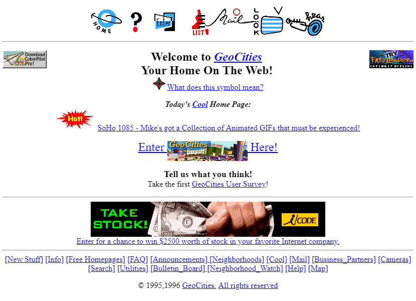

Por qual razão o Next.js se tornou um dos frameworks *frontend* mais populares dos últimos anos? E porque é utilizado sem ressalvas nas maiores aplicações em produção?

## Um pouco de história...

O Next.js surgiu em 2016 e fez parte de um movimento natural da web. 

### A era das páginas estáticas (1990 - 1999)

1. HTML e links
2. PHP e HTML gerado no servidor
3. Javascript e início de interatividade (popups, mensagens que apareciam)
4. Ajax - precursor dos frameworks javascript

### A era do Javascript (2000 - 2015)

1. Aplicações cada vez mais complexas - e *como era difícil fazer tudo com JS*
2. Surgimento do Angular e do React (seguido por Vue)
3. Adoção da componentização e renderização no cliente como forma de fazer a web. Facilidade de hospedagem - JAMStack.
4. Nem tudo que precisávamos estava na linguagem oficial (e muito menos nos browsers) -> precisamos de bundlers! CRA como solução
5. Problemas: SEO, JS grande para o hardware dos usuários, lentidão.

### A era do Next (2016 - Atualmente)

1. Next.js é o framework que combina as melhores características de diferentes eras do desenvolvimento web: simplicidade dos documentos estáticos, poder da renderização no servidor, componentização do React e boa experiência do usuário das SPAs.
2. Next.js simplifica a criação de páginas, rotas e APIs, além de recursos como geração estática, renderização no servidor e carregamento sob demanda.
3. Menciona funcionalidades como code splitting, otimização de imagens e Incremental Static Regeneration (ISR), que melhoram performance, SEO e experiência do usuário.
4. Finaliza destacando o Next.js como uma solução completa para criação de web apps, combinando inovações de décadas em um único framework. 
