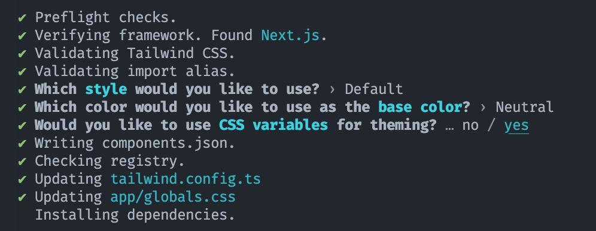

Para facilitarmos a criação de nossas páginas podemos recorrer a uma das principais bibliotecas de componentes existentes: `shadcn/ui`. Ela é fácil de ser instalada e agiliza o processo de prototipação e criação dos designs.

Uma coisa importante para saber sobre essa biblioteca - e provavelmente o aspecto que a levou a ficar tão famosa - é que os componentes não "vivem" dentro da biblioteca `shadcn/ui`. Eles são copiados e colados para nosso próprio projeto.

Isso significa que os componentes passam a ser nossos, independentemente de atualizações da biblioteca. E significa que podemos estilizá-los da forma que preferirmos.

## Onde iremos utilizar esses componentes?

Se analisarmos nosso Figma, existem alguns componentes que podemos reutilizar:

- Botões
- Input
- Cards

Além disso, também podemos criar nossos componentes customizados para reutilização. Olhando o design por cima podemos pensar em:

- Navbar
- Footer
- Logo (versão dark e light)
- Item de listagem de vaga

## Instalando o shadcn/ui

Vamos seguir [esses passos](https://ui.shadcn.com/docs/installation/next) para instalar a biblioteca.

```bash
npx shadcn@latest init
```

Agora, basta seguir os passos e a instalação está completa.

Vamos usar o padrão da instalação:


Veja que foram criados os arquivos:

- `components.json` (que é um arquivo de configuração básico do shadcn)
- `lib/utils` (que traz uma função muito útil chamada `cn()` que facilita a composição de classes com TailwindCSS)

E além disso foram modificados os:

- `tailwind.config.ts` (deverá mudar uma vez que o TailwindCSS não mais requer um arquivo de configuração)
- `globals.css`

Nestes dois arquivos, basicamente o que a biblioteca fez foi preparar para que todos os componentes tenham a mesma aparência. Para isso, criou algumas variáveis CSS tanto para o light mode como para o dark mode.
