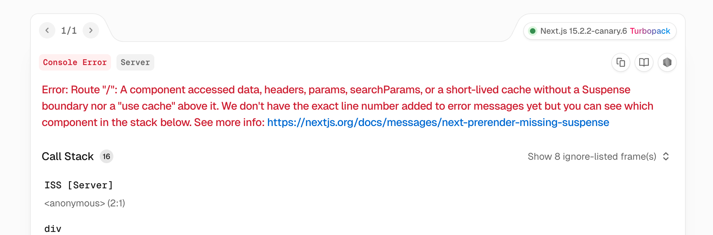

O `use cache` ainda não está disponível nas versões estáveis do Next.js (está na versão _canary_). Mas ao que tudo indica será a forma recomendada para fazer cache em aplicações Next.js.

Basicamente a forma de fazer cache no Next.js vai seguir as seguintes regras

1. Todo conteúdo dinâmico deverá ser envelopado por componente `<Suspense>`
2. Para o conteúdo estático, você irá usar a diretiva `use cache` para cachear
   - Layouts
   - Páginas
   - retornos de funções assíncronas.

Essa nova forma de fazer cache é chamada, pela Vercel, de `dynamicIO`.

### Na Prática

A primeira coisa que iremos ver é que o Next.js irá estourar um erro se você fizer um fetch sem suspense!

1. Vamos instalar a versão canary (a versão estável lança erro quando optamos pelo dynamicIO)
2. Vamos optar pelo recurso experimental dynamicIO
3. (opcional) Vamos optar pelo react-compiler também

Assim que fizermos o fetch:

Ou seja, **para deixar tudo muito claro** sobre o fetch, você deverá optar:

1. Por usar o `use cache` e cachear
2. Por envelopar o seu componente que faz fetch com um `<Suspense>` e deixar dinâmico.

Dessa forma torna-se impossível o dev não entender o que está rolando com o cache no Next.js.

### cacheTag e cacheLife

Agora, com a diretiva `"use cache"`, ao invés de controlar o cache - e revalidações - diretamente no fetch, você poderá fazer isto usando as funções `cacheTag` e `cacheLife`.

A função `cacheTag` serve para você _"taguear"_ um cache para revalidá-lo posteriormente usando a função `revalidateTag()`.

A função `cacheLife` é útil para definir um tempo para revalidação. Você deverá passar uma string com o _nome do perfil de cache_. Você pode definir perfis no seu `next.config.ts` (`experimental` > `cacheLife`) ou utilizar alguns dos perfis já definidos pelo Next.js

Há 3 campos a considerar quando criar um perfil. Todos são opcionais.

- `stale` - tempo do cache no cliente
- `revalidate` - tempo do cache no servidor. Pode ainda servir valores _stale_
- `expire` - tempo máximo que um cache pode ficar _stale_. Passado esse tempo o fetch é dinâmico.
