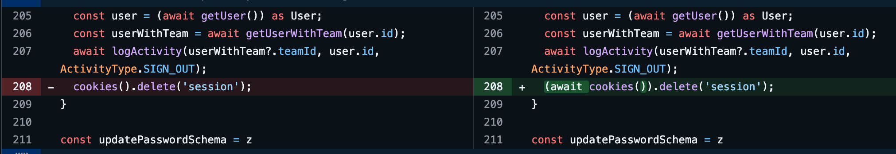

Algumas APIs do Next.js que antes eram síncronas, tornaram-se assíncronas.

A [razão](https://nextjs.org/blog/next-15-rc2#async-request-apis-breaking-change) para isso é relativamente simples:

- O SSR Tradicional sempre esperava um *request* antes de renderizar qualquer conteúdo.
- Mas nem todos os componentes dependem do *request* para renderizar. Em tese eles poderiam iniciar a renderização antes do request "chegar"
- Logo, todas as APIs que dependem de dados específicos do request tornaram-se **assíncronas**.

### O que mudou?

As seguintes APIs tornaram-se assíncronas:

- `cookies`
- `headers`
- `params` (prop de páginas, layouts, route handlers, etc.)
- `searchParams` (prop de páginas)

### Como fazer a alteração?

É fácil e simples. Basta apenas esperar as promises se resolverem.



:::caution
Atenção que, ao contrário dos `cookies` e `headers` as props `params` e `searchParams` já são Promises - e não funções que retornam promises! Isso significa que basta esperá-las (não podemos invocá-las).
:::

Com o codemod:

```bash
npx @next/codemod@latest next-async-request-api .
```
