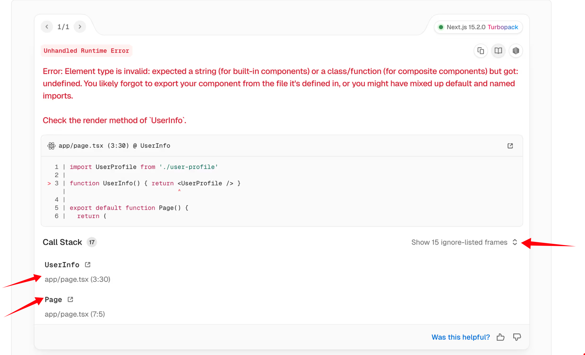

### Novo DevTools

Agora há um novo "devtools" do Next.js - que foi reformulado na versão 15.2.

Além de um visual bastante *shadcnizado*, você pode escolher tema e posição na tela.

Mas o mais importante é que ali você consegue ver se a página é estática ou dinâmica bem como os erros.

E o futuro é interessante para esse DevTools. Em breve aparecerá dados de cache, *partial pre-rendering*, e *outras coisitas más*.

### Turbopack

O Turbopack finalmente está estável para o *dev server* (para usar basta rodar `next dev --turbo`).

Ainda não há previsão (mas será feito) sobre Turbopack em builds de produção.

### Mensagens de Erro

A call stack nas mensagens de erro está mais fácil de ser entendida por "humanos". Reduziram-se mensagens de bibliotecas e de *internals*

### Suporte para typescript no `next.config.ts`

A partir de agora o arquivo de configuração do Next pode ser Typescript - e não apenas Javascript.

Além disso o Next traz um type `NextConfig` para auxiliar no autocomplete.
