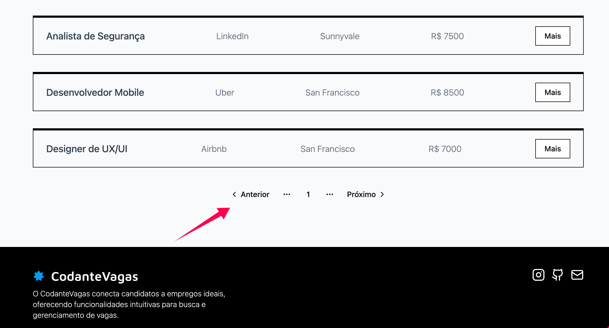

Agora, de forma semelhante, vamos adicionar a funcionalidade de paginação na nossa lista de vagas.

## Exercício 01 - Crie a UI da Paginação

Você deverá criar uma UI como essa abaixo:



Apenas a UI é necessária por enquanto. A implementação será feita posteriormente.

:::tip
Da mesma forma que fizemos com a busca textual, vamos utilizar `shadcn/ui` para criar a UI da paginação.
:::

### Resolução - UI da Paginação

A primeira coisa que precisamos fazer é instalar o [componente pagination](https://ui.shadcn.com/docs/components/pagination) do `shadcn/ui`.

```bash
npx shadcn@latest add pagination
```

Feito isso, vamos criar o componente `jobs-pagination.tsx` na pasta `app/vagas/_components`.

```typescript
// app/vagas/_components/jobs-pagination.tsx
import {
  Pagination,
  PaginationContent,
  PaginationEllipsis,
  PaginationItem,
  PaginationLink,
  PaginationNext,
  PaginationPrevious,
} from "@/components/ui/pagination";

export default async function JobsPagination() {
  return (
    <Pagination>
      <PaginationContent>
        <PaginationItem>
          <PaginationPrevious href="#" />
        </PaginationItem>
        <PaginationItem>
          <PaginationEllipsis />
        </PaginationItem>
        <PaginationItem>
          <PaginationLink>1</PaginationLink>
        </PaginationItem>
        <PaginationItem>
          <PaginationEllipsis />
        </PaginationItem>
        <PaginationItem>
          <PaginationNext href="#" />
        </PaginationItem>
      </PaginationContent>
    </Pagination>
  );
}
```

Depois, vamos utilizar esse componente dentro do `jobs-list`.

```typescript
// vagas/jobs-list.tsx
import JobItem from "@/components/cards/job-item";
import { Job } from "@/lib/types";
import JobsPagination from "./_components/jobs-pagination1";

async function fetchJobs(searchString: string) {
  const params = new URLSearchParams();
  if (searchString) {
    params.set("search", searchString);
  }

  const res = await fetch(
    `https://apis.codante.io/api/job-board/jobs?${params.toString()}`,
    {
      cache: "no-store",
    },
  );

  if (!res.ok) {
    throw new Error("Ops, alguma coisa deu errada!");
  }

  const json = await res.json();
  const jobs: Job[] = json.data;
  return jobs;
}

export default async function JobsList({
  searchParams,
}: {
  searchParams: Promise<{ [key: string]: string | string[] | undefined }>;
}) {
  const resolvedSearchParams = await searchParams;
  const searchString = resolvedSearchParams.search as string;

  const jobs = await fetchJobs(searchString);

  return (
    <div className="space-y-8">
      {jobs.map((job) => (
        <JobItem key={job.id} job={job} />
      ))}
      <JobsPagination />
    </div>
  );
}
```

Maravilha! Temos nossa UI de paginação sendo exibida corretamente. Agora, vamos fazer a implementação da funcionalidade.

---

## Exercício 02 - Estado na URL

Novamente, vamos utilizar o estado na URL para armazenar o número da página atual.

Neste exercício, vamos apenas adicionar o estado à URL. A exibição dos itens de acordo com a página selecionada será feita no próximo exercício.

Basicamente, vamos adicionar um novo parâmetro à URL, chamado `page`, que armazenará o número da página atual. Toda vez que o usuário clicar em "próximo" ou "anterior", vamos atualizar a nova página no estado na URL.

### Resolução - Estado na URL

Vamos alterar o componente `jobs-pagination` para que ele utilize o estado na URL.

```typescript
// vagas/_components/jobs-pagination.tsx
import {
  Pagination,
  PaginationContent,
  PaginationEllipsis,
  PaginationItem,
  PaginationLink,
  PaginationNext,
  PaginationPrevious,
} from "@/components/ui/pagination";

export default async function JobsPagination({
  searchParams,
}: {
  searchParams: Promise<{ [key: string]: string | string[] | undefined }>;
}) {
  const resolvedSearchParams = await searchParams;
  const currentPageNumber = Number(resolvedSearchParams.page ?? 1);

  function createPageUrl(pageNumber: number) {
    const params = new URLSearchParams();
    if (resolvedSearchParams.search) {
      params.set("search", resolvedSearchParams.search as string);
    }
    params.set("page", pageNumber.toString());
    return `?${params.toString()}`;
  }

  return (
    <Pagination>
      <PaginationContent>
        <PaginationItem>
          <PaginationPrevious
            href={
              currentPageNumber > 1 ? createPageUrl(currentPageNumber - 1) : "#"
            }
          />
        </PaginationItem>
        <PaginationItem>
          <PaginationEllipsis />
        </PaginationItem>
        <PaginationItem>
          <PaginationLink>{currentPageNumber}</PaginationLink>
        </PaginationItem>
        <PaginationItem>
          <PaginationEllipsis />
        </PaginationItem>
        <PaginationItem>
          <PaginationNext href={createPageUrl(currentPageNumber + 1)} />
        </PaginationItem>
      </PaginationContent>
    </Pagination>
  );
}
```

---

## Exercício 03 - Utilizando os dados da API

Frequentemente, os dados de uma API são paginados, e também, frequentemente, os dados da paginação são retornados pela API.

A nossa API de vagas retorna, além dos dados das vagas `data`, os dados da paginação em objetos `links` e `meta`.

Vamos utilizar os dados da API para exibir apenas os itens da página correspondente ao estado na URL, bem como para deixar a paginação mais correta.

Na paginação:

- Você não poderá retroceder para páginas com número 0 ou negativos.
- Você não poderá avançar além da última página.

Ajuste sua paginação de acordo. Como exercício extra, ajuste também o CSS para a UX ficar mais correta.

### Resolução

Vamos alterar o componente `jobs-list` para resolver o exercício. Além de já recebermos `searchParams` como *props*, vamos também receber o objeto `meta`, que é retornado em nossa API.

Antes de tudo, então, vamos definir o objeto `meta` no nosso componente.

```typescript
// lib/types.ts
export type Meta = {
  current_page: number;
  from: number;
  last_page: number;
};
```

Agora, vamos alterar o componente `jobs-list` para ajustar a paginação:

- Vamos atualizar a função `fetchJobs` para retornar também o objeto `meta`.
- Vamos atualizar a função `fetchJobs` para adicionar, nos parâmetros do endpoint, a busca textual (que já estava feita) e a página atual (que será o estado na URL). Ambos serão passados como argumentos para a `fetchJobs()`.

```typescript
// vagas/jobs-list.tsx
import JobItem from "@/components/cards/job-item";
import { Job } from "@/lib/types";
import JobsPagination from "./_components/jobs-pagination";

async function fetchJobs(search: string = "", page?: string) {
  const params = new URLSearchParams();
  if (search) {
    params.set("search", search);
  }
  if (page) {
    params.set("page", page);
  }
  const queryString = params.toString() ? `?${params.toString()}` : "";

  const res = await fetch(
    `https://apis.codante.io/api/job-board/jobs${queryString}`,
    {
      cache: "no-store",
    },
  );
  if (!res.ok) {
    throw new Error("Ops, alguma coisa deu errada!");
  }

  const json = await res.json();
  const jobs: Job[] = json.data;
  const meta = json.meta;
  return { jobs, meta };
}

export default async function JobsList({
  searchParams,
}: {
  searchParams: Promise<{ [key: string]: string | string[] | undefined }>;
}) {
  const { jobs, meta } = await fetchJobs(
    ((await searchParams).search ?? "") as string,
    ((await searchParams).page ?? "") as string,
  );

  return (
    <div className="space-y-8">
      {jobs.map((job) => (
        <JobItem key={job.id} job={job} />
      ))}
      <JobsPagination meta={meta} searchParams={searchParams} />
    </div>
  );
}
```

Agora, como segundo passo, vamos alterar o componente `jobs-pagination` para que ele utilize os dados da API.

```typescript
// vagas/_components/jobs-pagination.tsx
import { Meta } from "@/lib/types";
import {
  Pagination,
  PaginationContent,
  PaginationEllipsis,
  PaginationItem,
  PaginationLink,
  PaginationNext,
  PaginationPrevious,
} from "@/components/ui/pagination";

export default async function JobsPagination({
  meta,
  searchParams,
}: {
  meta: Meta;
  searchParams: Promise<{ [key: string]: string | string[] | undefined }>;
}) {
  const resolvedParams = await searchParams;

  const createPageUrl = async (pageNumber: number) => {
    const params = new URLSearchParams();
    if (resolvedParams.search) {
      params.set("search", resolvedParams.search as string);
    }
    params.set("page", pageNumber.toString());
    return `?${params.toString()}`;
  };

  return (
    <Pagination>
      <PaginationContent>
        <PaginationItem>
          <PaginationPrevious
            href={
              await (meta.current_page > 1
                ? createPageUrl(meta.current_page - 1)
                : "#")
            }
            className={
              meta.current_page <= 1 ? "pointer-events-none opacity-50" : ""
            }
          />
        </PaginationItem>
        {meta.current_page > 2 && (
          <PaginationItem>
            <PaginationEllipsis />
          </PaginationItem>
        )}
        <PaginationItem>
          <PaginationLink>{meta.current_page}</PaginationLink>
        </PaginationItem>
        {meta.last_page - meta.current_page > 1 && (
          <PaginationItem>
            <PaginationEllipsis />
          </PaginationItem>
        )}
        <PaginationItem>
          <PaginationNext
            href={
              await (meta.current_page < meta.last_page
                ? createPageUrl(meta.current_page + 1)
                : "#")
            }
            className={
              meta.current_page >= meta.last_page
                ? "pointer-events-none opacity-50"
                : ""
            }
          />
        </PaginationItem>
      </PaginationContent>
    </Pagination>
  );
}
```

Maravilha! Temos nossa paginação funcionando de forma correta.

---
