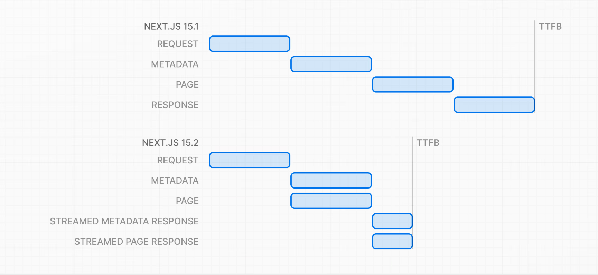

## create-next-app --api

O Next.js agora também tem um *boilerplate* para criar APIs *sem nada de React*.

Basta passar a `--api` para o Create Next App e você terá uma aplicação que irá funcionar apenas com os *Route Handlers* e não com páginas tradicionais.

## Streaming Metadata

Agora o resultado do `generateMetadata` é streamado para o cliente assim que estiver pronto - não mais bloqueando a página principal de renderizar.  

Mais detalhes sobre o generateMetadata [aqui](https://nextjs.org/docs/app/api-reference/functions/generate-metadata).

Antes e depois:


## Middlewares com Node

Tradicionalmente, um `middleware` no Next.js apenas roda no Edge. Isso significa que nem toda a API do Node é compatível. Agora, com essa atualização, é possível, *de forma experimental*, usar middlewares que rodam no runtime Node.js, ou seja, com muito mais compatibilidade.

Para habilitar essa feature experimental:

```typescript
// next.config.ts
module.exports = {
  experimental: {
    nodeMiddleware: true,
  },
};
```

Feito isso, no objeto config do middleware, você deverá adicionar a chave/valor `runtime: 'nodejs'`

```typescript
// middleware.ts
export const config = {
  // ...
  runtime: 'nodejs',
};
```

## Devtools / Turbopack

Já falamos isso, mas não custa relembrar:

- Melhorias no *Devtools* (mais bonito e pronto para trazer mais infos)
- Melhorias no *Turbopack* (bem mais rápido e usando menos memória no dev server)
