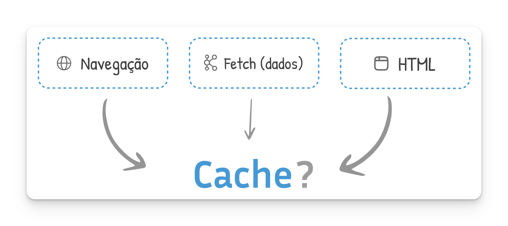
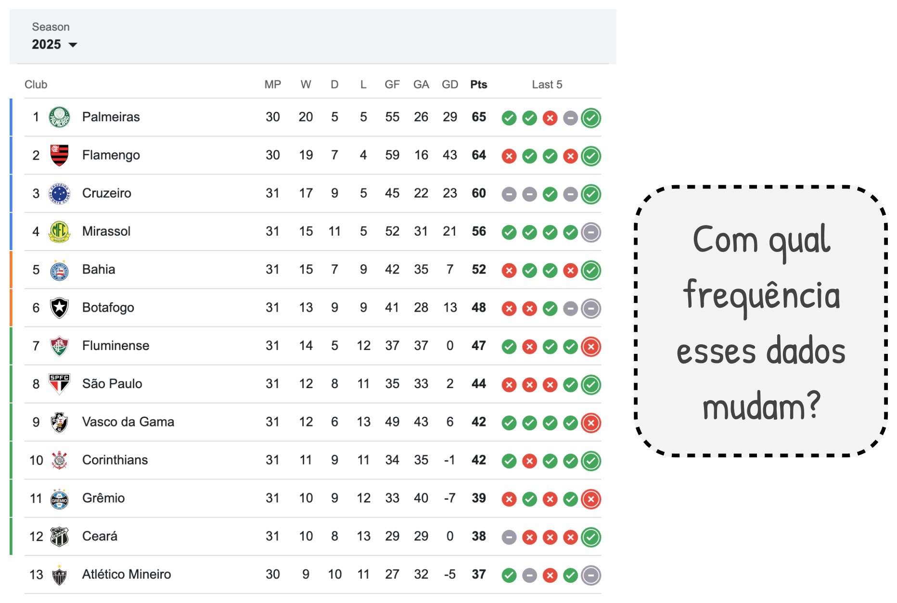

O Next.js tem uma certa história de "**amor e ódio**" em relação ao cache.

A razão é simples: o frameworks sempre foi **otimizado para a melhor performance** possível. Sempre que houvesse a possibilidade de fazer cache, o framework abraçou essa ideia.

No fim das contas, 3 são as possibilidades básicas de cache no Next.js

1. Navegação (router)
2. Fetch de dados
3. Elementos (ou toda a página) HTML

## Como era antes da v16?

### Client Side Caching

Você pode configurar sua aplicação Next.js para que, ao passar os dados em cima de um *link*, o conteúdo daquela próxima página já ser "baixado" para você. 

### Fetch de Dados
Vamos pensar em um website dinâmico que renderiza a Tabela do Ranking do Brasileirão. Veja, provavelmente sua aplicação irá buscar esses dados de alguma fonte. E eles mudam (ou seja, a página não pode ser estática). 

Mas quanto eles mudam? Esses dados não podem ser *cacheados* de alguma forma?

Foi aqui que o Next.js *alterou* o fetch nativo para fazer cache *para você*. E muita gente criticou

### Cache de toda Página HTML

Vamos pensar em um **blog**. Quando é que esse conteúdo irá mudar? Provavelmente nunca. Não faz sentido cada vez que alguém visita sua página (request), você faça uma chamada API no seu CMS (*Content Management System*).

É daí que veio a ideia - antiga - de páginas estáticas e páginas dinâmicas no Next.js. 

## E após a v16?

Cache Components foram uma das melhores implementações no Next.js. A razão para isso é que, na maioria dos casos, podemos esquecer tudo o que vimos de cache até agora. Não precisamos ficar preocupados se uma página está sendo renderizada de forma estática quando tem conteúdos dinâmicos. Ou que ela desnecessariamente era dinâmica quando deveria ser estática. 

Nada disso. 

Vamos usar Cache Components - e tudo vai ficar mais simples. 