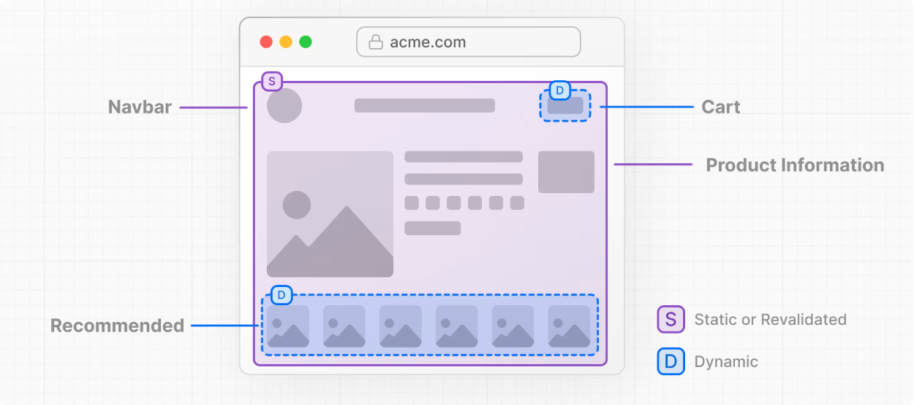

## Comandos Iniciais

Vamos instalar nossa aplicação:

```bash
bun create next-app@latest my-next16-app
```

Maravilha, podemos marcar `sim` para todas as perguntas.

Depois, vamos entrar na pasta do projeto e limpar tudo que não vamos usar. Pronto! Agora temos uma aplicação Next.js 16 limpa, pronta para usarmos Cache Components 🥳!


## Rodando o App com Cache Components

Se você rodar o app agora, verá que tudo funciona normalmente. Só que não estamos usando Cache Components ainda - mesmo estando na v16. Para que possamos usar Cache Components, precisamos alterar a configuração do Next.js: 

```ts title="next.config.ts"
import type { NextConfig } from 'next';

const nextConfig: NextConfig = {
  cacheComponents: true,
};

export default nextConfig;
```

Maravilha! Tudo certo agora. 

## Mas o que mudou?

Tudo! Pra começar, todas as páginas são dinâmicas por padrão. E a gente lançando mão de uma funcionalidade chamada Partial Pre Rendering (PPR).



Ok, vamos comparar lado a lado então o que temos até agora.

|Página Dinâmica| Página Estática|Estática com ISR|Partial Pre Rendering (PPR)|
|-|-|-|-|
|Toda requisição gera uma nova renderização no servidor - O HTML é gerado a cada request|A página (HTML) é gerada uma vez e a mesma página é servida para todas as requisições|É a mesma coisa que a página estática. A diferença é que a página é "*rebuildada*" em segundo plano sob demanda ou após algum tempo|Toda parte *estática* da página já foi gerada no build. As partes dinâmicas são "preenchidas" depois via streaming.|
|**Desvantagem**: Performance|**Desvantagem**: Mesma página para todos os usuários|**Desvantagem**: Revalidação em segundo plano|-|


<Callout>Na nova opção de Cache Components, podemos fazer cada um desses comportamentos (separados ou combinados) de forma mais simples e eficiente.</Callout>

Vamos ver agora isso funcionando na prática com Cache Components. 

