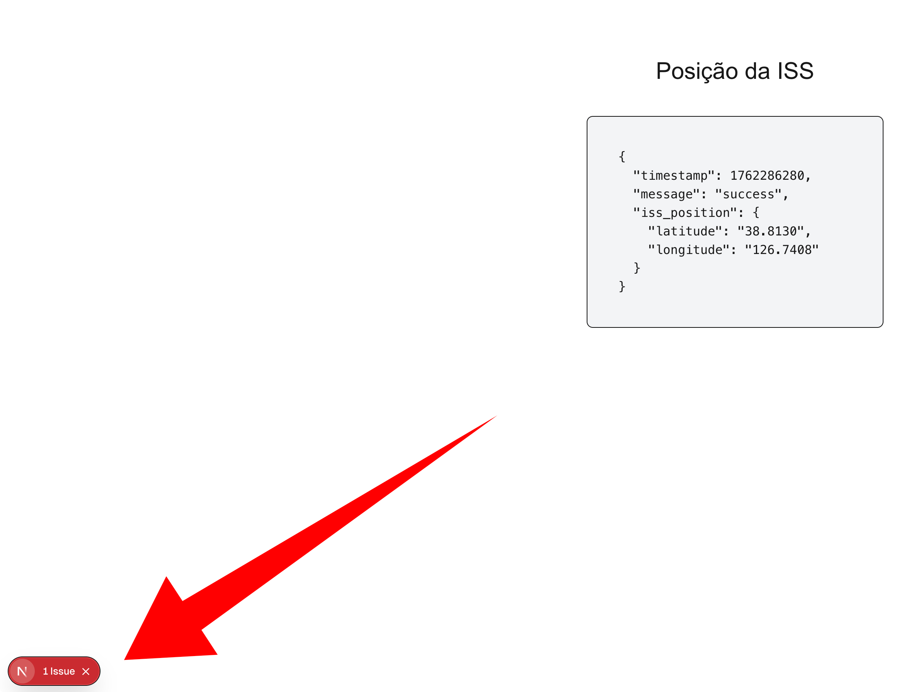
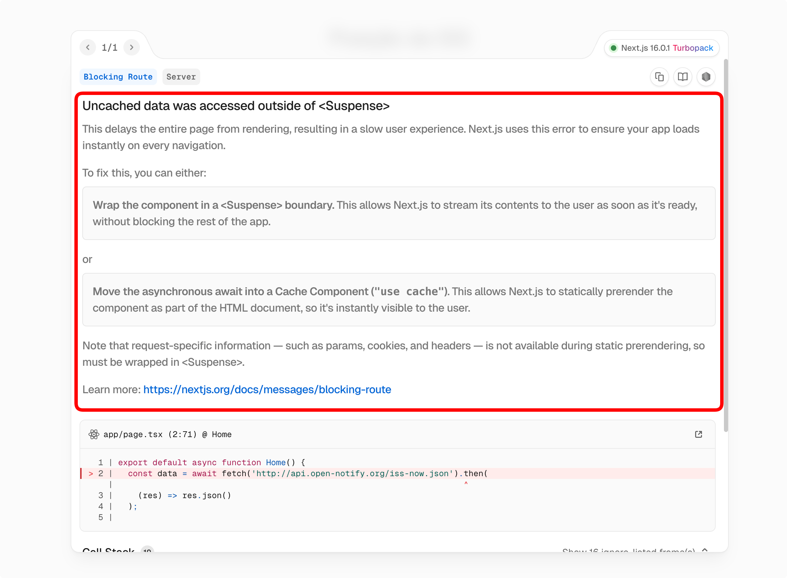

Para exemplificar o uso de Cache Components no Next.js 16, vamos construir um pequeno projeto chamado **Astro Hub**.

A primeira funcionalidade do Astro Hub é mostrar, de forma atualizada, a posição da ISS (Estação Espacial Internacional) em um mapa. Para isso, usaremos a API pública [Open Notify](http://open-notify.org/Open-Notify-API/ISS-Location-Now/) que fornece a localização atual da ISS.

A resposta da API é algo assim:

```json title="Resposta da API"
{
  "message": "success",
  "timestamp": 1596561600,
  "iss_position": {
    "latitude": "48.8584",
    "longitude": "2.2945"
  }
}
```

## Fetch com RSC (React Server Components)

Como estamos, por padrão, em um componente de servidor (RSC), podemos fazer o fetch diretamente no componente da página.


```tsx title="app/page.tsx"
export default async function Home() { 
  const data = await fetch('http://api.open-notify.org/iss-now.json').then( // [!code ++]
    (res) => res.json() // [!code ++]
  ); // [!code ++]

  return (
    <main className="text-center p-24">
      <h1 className="text-3xl mb-10">Posição da ISS</h1>
      <pre className="text-left max-w-sm mx-auto bg-gray-100 p-10 rounded-lg border">{/* [!code ++] */}
        {JSON.stringify(data, null, 2)}{/* [!code ++] */}
      </pre>{/* [!code ++] */}
    </main>
  );
}
```

## Nosso primeiro erro

Eu já disse que a nova API do *Cache Components* é sensacional? Você vai entender. 

#### O que está acontecendo aqui?

1. Mudamos a configuração para que o Next use `Cache Components`. 
2. A partir desse momento, vamos utilizar - automaticamente - a estratégia de Partial Pre-Rendering. 
3. Temos um problema: o Next.js tentará renderizar estaticamente tudo, como o título H1 (posição da ISS). Contudo, uma parte da nossa aplicação é dinâmica, que é a chamada para a API da ISS. 

Então, de forma graciosa, o Next.js já nos avisa:



... que temos um problema:




## Primeira regra: As páginas são dinâmicas, mas tudo é estático - a menos que você diga o contrário. 

- Ao usarmos os `cache components`, todas as páginas serão consideradas dinâmicas por padrão. 
- Entretanto, o Next vai tentar inferir tudo o que é estático dessas páginas (para que essas partes sejam pré-renderizadas no build - ou, em outras palavras, *Partial Pre Rendering*).
- Se você inadvertidamente fizer uma chamada API dentro de um componente que está sendo pré-renderizado, o Next vai reclamar.

### Por que ele reclama?

Esse erro é porque o Next precisa saber uma das duas coisas: 

1. Se a chamada API pode ser cacheada (ou seja, se ela não muda com o tempo).
2. Se a chamada API é dinâmica (ou seja, se ela muda em cada request).

|Chamada API pode ser cacheada|Chamada API é dinâmica|
|-|-|
|A **página toda** pode ser pré-renderizada (estática)|A página **não pode** ser pré-renderizada (dinâmica)|
|Você precisa colocar `'use cache'`|Você precisa envolver o trecho dinâmico com `<Suspense>`|


## É isso. Você já sabe 95% do que precisa para usar Cache Components no Next.js 16.

Não é incrível?

