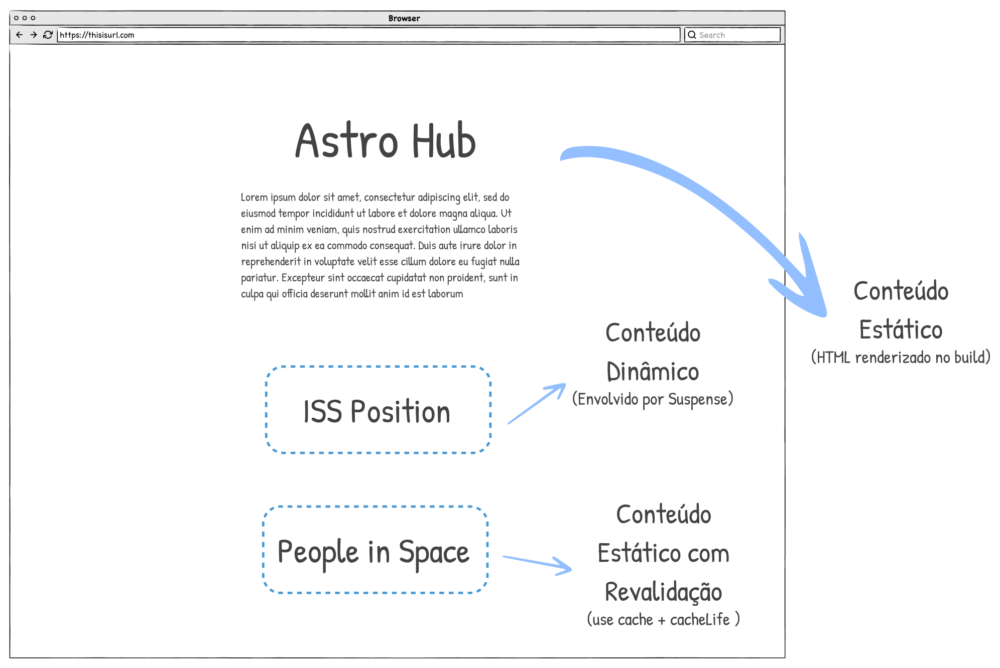

No final das contas, nossa aplicação ficou mais ou menos assim: 

A vantagem dos caches components é que você não precisa pensar muito nem como manter seus dados atualizados ou como pré-renderizar para melhor performance. 

Sem muito esforço:

- A parte estática das suas páginas já é pré-renderizada (em HTML)
- A parte dinâmica é 'streamada' para o navegador quando estiver pronta. 