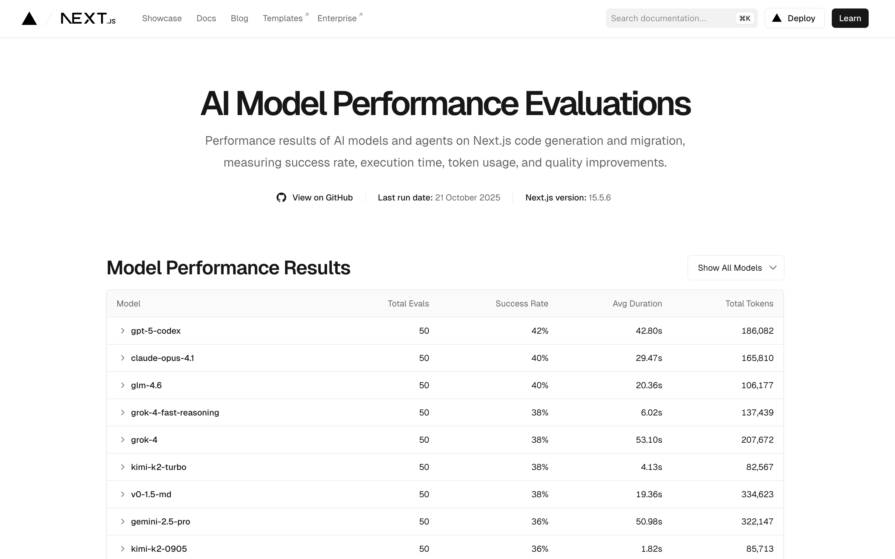

Next.js [Evals](https://nextjs.org/evals) é uma iniciativa de benchmark que avalia a performance de modelos de IA e agentes de codificação em tarefas relacionadas ao Next.js, como geração de código e migrações.

## O que é Next.js Evals?

Lançado junto com o Next.js 16, o Next.js Evals é um conjunto de testes padronizados que mede a capacidade de modelos de IA e agentes de codificação em realizar tarefas reais de desenvolvimento Next.js.

Os testes avaliam:

- **Taxa de Sucesso**: Percentual de tarefas completadas com sucesso
- **Tempo de Execução**: Velocidade média para completar cada tarefa
- **Uso de Tokens**: Quantidade de tokens consumidos durante a execução
- **Qualidade do Código**: Precisão e aderência às melhores práticas do Next.js

## Modelos Avaliados

O benchmark testa uma ampla variedade de modelos de IA, incluindo:

### Top Performers (Taxa de Sucesso > 40%)

- **gpt-5-codex**: 42% de sucesso
- **claude-opus-4.1**: 40% de sucesso
- **glm-4.6**: 40% de sucesso

### Modelos de Alta Performance (38-40%)

- **grok-4-fast-reasoning**: 38% com apenas 6.02s de tempo médio
- **grok-4**: 38% de sucesso
- **kimi-k2-turbo**: 38% com 4.13s de tempo médio
- **v0-1.5-md**: 38% de sucesso

### Modelos Populares

- **claude-sonnet-4.5**: 32% de sucesso, 11.14s
- **claude-sonnet-4**: 32% de sucesso, 10.27s
- **gemini-2.5-pro**: 36% de sucesso
- **gpt-4o**: 26% de sucesso

## Agentes de Codificação

Além dos modelos, o Next.js Evals também avalia agentes completos de codificação:

| Agente              | Taxa de Sucesso |
| ------------------- | --------------- |
| Claude              | 42%             |
| Cursor (Sonnet 4.5) | 38%             |
| Copilot (Sonnet 4)  | 38%             |
| Cursor (Composer-1) | 32%             |
| Codex               | 30%             |
| Gemini              | 28%             |

## Por que os Evals são Importantes?

1. **Transparência**: Fornece dados objetivos sobre a capacidade real dos modelos em tarefas de desenvolvimento
2. **Escolha Informada**: Ajuda desenvolvedores a escolher o melhor modelo/agente para suas necessidades
3. **Benchmark da Indústria**: Define um padrão para avaliar assistentes de IA focados em Next.js
4. **Evolução Contínua**: Os testes são atualizados regularmente para refletir as versões mais recentes do Next.js

## Informações sobre os Testes

- **Última execução**: 21 de Outubro de 2025
- **Versão do Next.js**: 15.5.6
- **Número de testes**: 50 por modelo
- **Repositório**: [github.com/vercel/next-evals-oss](https://github.com/vercel/next-evals-oss)

## Como Interpretar os Resultados

### Taxa de Sucesso

Indica quantas tarefas o modelo conseguiu completar corretamente. Taxas acima de 30% são consideradas boas para tarefas complexas de desenvolvimento.

### Tempo de Execução

Modelos mais rápidos são ideais para desenvolvimento iterativo, enquanto modelos mais lentos podem ser melhores para tarefas que exigem maior profundidade de análise.

### Uso de Tokens

Importante para considerar custos operacionais. Modelos que usam menos tokens são mais econômicos, especialmente em uso contínuo.

## Acesse os Resultados

Visite [nextjs.org/evals](https://nextjs.org/evals) para ver os resultados completos e atualizados, com detalhes sobre cada modelo e agente testado.
