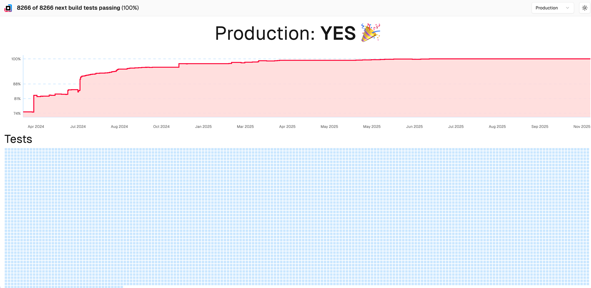

O Turbopack é o novo bundler oficial do Next.js 16, substituindo o Webpack como bundler padrão. Ele é escrito em Rust e otimizado para projetos grandes, oferecendo velocidades de compilação significativamente mais rápidas.



## Turbopack

O Turbopack foi projetado especificamente para resolver problemas de performance do Webpack em projetos grandes:

- **700x mais rápido que o Webpack** em cold starts
- **Compilação incremental** extremamente rápida
- **HMR (Hot Module Replacement)** instantâneo
- **Melhor suporte a TypeScript** com verificação de tipos mais eficiente
- **Diagnósticos mais precisos** com informações detalhadas sobre erros

### Mudanças no Next.js 16

Com o Next.js 16, o Turbopack se torna o bundler padrão para desenvolvimento e builds de produção:

- `next dev` agora inicia diretamente com Turbopack, sem necessidade da flag `--turbo`
- `next build` usa Turbopack sempre que possível, caindo para Webpack apenas se você utilizar APIs ainda não suportadas

### Características principais

#### Compilação rápida

O Turbopack consegue compilar projetos grandes em segundos, não minutos. Isso é especialmente útil em:

- Projetos com milhares de módulos
- Times com múltiplos desenvolvedores trabalhando simultaneamente
- CI/CD pipelines que precisam de builds rápidos

#### HMR instantâneo

O Hot Module Replacement do Turbopack é quase instantâneo, permitindo que você veja suas mudanças no navegador em milissegundos. Isso transforma a experiência de desenvolvimento.

#### Compatibilidade

O Turbopack mantém compatibilidade com:

- Ecossistema React completo
- CSS e frameworks CSS
- TypeScript nativo
- Módulos Node.js

## Turbopack File System Caching

Para deixar ainda mais rápido o ambiente dev, agora o Turbopack suporta cache em arquivos. Isso faz com que os "restarts" do servidor de desenvolvimento sejam muito mais rápidos, já que o cache é persistido entre sessões.

```ts title="next.config.ts"
const nextConfig = {
  experimental: {
    turbopackFileSystemCacheForDev: true,
  },
};

export default nextConfig;
```
