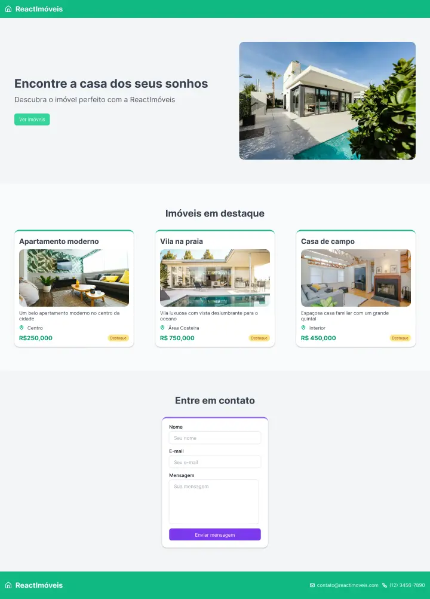

Vamos começar? Antes de mais nada, um overview do que iremos tratar no Workshop de hoje. Vamos aprender sobre React desde o básico. O objetivo será passar pelos principais conceitos de forma prática e didática. Para isso, vamos construir uma aplicação do zero.

## O que vamos aprender hoje?

Os principais tópicos que iremos ver são:

#### Conteúdo

1. Introdução
2. Por trás dos panos do React
3. Configurando um app React
4. Componentes no React
5. Aprendendo JSX
6. Implementando os componentes
7. Aprofundando no React

#### Vamos construir uma aplicação

Nesse workshop, vamos construir uma aplicação do zero. Vamos começar com um exemplo bem simples e ir adicionando novas funcionalidades conforme vamos aprendendo os novos conceitos.

Você pode acessar o design da aplicação no Figma: [https://www.figma.com/community/file/1432049109831051738](https://www.figma.com/community/file/1432049109831051738)

