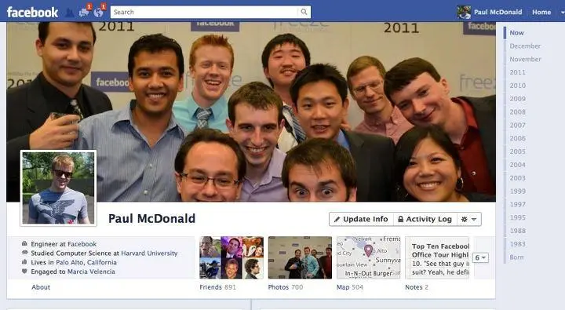

Como mencionado anteriormente, o React foi criado pelo time do Facebook para resolver um problema específico: a criação de interfaces de usuário.

Em 2011 o Facebook era provavelmente a maior aplicação web do mundo e portanto já sofria com problemas que provavelmente ninguém havia passado por antes.

> Curiosidade: em 2011 o Facebook lançou a feature de "Timeline"

O Facebook já tinha uma série de ferramentas internas para criação de interfaces de usuário, similares a outras ferramentas existentes na época como o Backbone.js, mas elas eram muito específicas para o Facebook e também estavam chegando ao seu limite conforme o Facebook crescia exponencialmente.

Com isso, algumas pessoas do time do Facebook começaram a trabalhar em uma nova biblioteca que tinha uma abordagem diferente das ferramentas existentes na época.

A principal inovação dessa nova biblioteca era como ela tratava a manipulação do DOM. Parecia uma ideia "maluca", mas que se provou ser uma grande otimização.

Ao invés de atualizar o DOM a cada nova interação do usuário (ou alteração do estado), a biblioteca simplesmente jogava todo o DOM fora e criava tudo do zero. Foi daí que surgiu o famoso "virtual DOM".

Recomendação de material para aprofundar:

- [How A Small Team of Developers Created React at Facebook | React.js: The Documentary](https://www.youtube.com/watch?v=8pDqJVdNa44)
