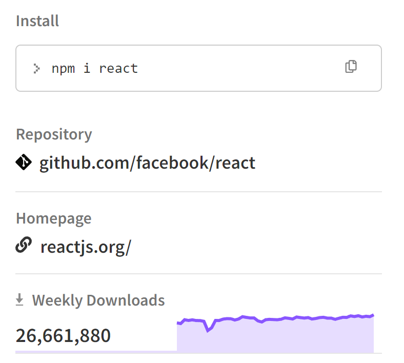

Em 2011, quando o React foi pensado, a web era um pouco diferente do que é hoje.

No JavaScript:

1. Não existia `let` e nem `const` no JavaScript.
2. Não existiam classes no JavaScript.
3. Não existia `async/await` no JavaScript.
4. Não existia `import` e nem `export` para módulos.
5. Não existia a função nativa `Fetch`.

No HTML:

1. HTML5 estava apenas começando a ser adotado, introduzindo alguns elementos semânticos e APIs, como `<canvas>`, `<video>`, e `<audio>`.

No CSS:

1. Não existia Flexbox.
2. Não existia Grid Layout.
3. Não existiam variáveis CSS.

Nos navegadores:

1. O suporte era limitado para ES6, HTML5 e CSS3.
2. DevTools eram bem mais primitivas.

Considerando tudo isso, hoje em dia o ecossistema web é bem mais poderoso. Portanto podemos nos questionar: será que você precisa mesmo de React ou outros frameworks/bibliotecas?

Existem opiniões diversas sobre esse tema, então não é incomum você encontrar pessoas falando que "React é um lixo desnecessário", que você pode fazer o mesmo sem ele, ou que ele apenas adiciona complexidade desnecessária.

Eu prefiro uma abordagem mais analítica.

### O problema é maior do que parece

A princípio, pode parecer que o problema é simples: você quer uma interface web, então você usa HTML, CSS e JavaScript.

Mas na prática você se depara com vários problemas que um framework/biblioteca como React (e seu ecossistema) te ajudam a resolver.

Por exemplo:

1. O seu código vai crescer e você vai precisar de ferramentas para distribuir o código de forma eficiente. Por exemplo Webpack ou Vite.
2. Você vai precisar criar rotas para sua aplicação.
3. Você vai precisar lidar com problemas de performance e acessibilidade.
4. Você vai precisar de ferramentas para testar seu código.
5. Você vai precisar de formas para gerenciar o estado do seu app.
6. Você vai precisar lidar com erros inesperados.

### Hoje em dia, a maior parte das aplicações web precisam de funcionalidades complexas.

A maioria das aplicações web atuais, precisam de atualizações em tempo real e interações complexas com os usuários.

Talvez um app simples como uma landing page, não precise de um framework/biblioteca como React, mas para a maioria das aplicações web, o React vai trazer benefícios.

### O ecossistema do React é muito robusto.

São mais de 10 anos de evolução, tendo uma empresa gigante por trás. Isso traz uma segurança de que ele vai continuar evoluindo. E ao mesmo tempo, existem milhares de bibliotecas complementares que podem te ajudar.

Em um ecossistema tão grande, é muito provável que qualquer problema que você encontrar, já tenha alguém que já tenha passado por isso.

### O React é amplamente adotado por MUITAS empresas de todos os portes.

