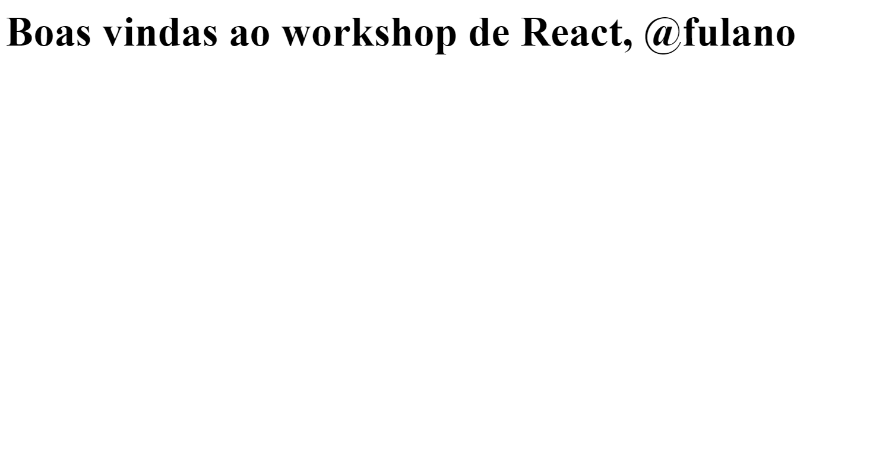
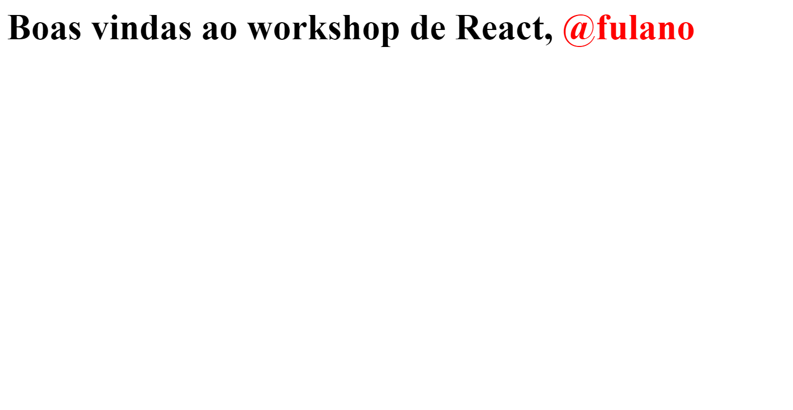

Para entender como o React funciona, vamos primeiro relembrar como funciona o modelo "tradicional" com JavaScript + HTML.

Vamos criar um exemplo bem simples de uma aplicação web com HTML + JavaScript.

Vamos criar uma pasta para esse exemplo:

```bash
mkdir exemplo-01-dom
cd exemplo-01-dom
```

Agora você precisa de uma estrutura HTML básica, e aqui vamos reduzir o máximo possível. Crie um arquivo `index.html` e adicione o seguinte código:

```html
<html>
  <body>
    <script src="script.js"></script>
  </body>
</html>
```

Como queremos uma aplicação interativa, vamos precisar de JavaScript.

Vamos criar um arquivo `script.js` e adicionar o seguinte código:

```js
console.log("Hello World");
```

Para rodar esse código, você precisa abrir o arquivo `index.html` no seu navegador. Vamos utilizar uma ferramenta auxiliar para isso.

Basta abrir o terminal e executar o comando:

```bash
npx http-server .
```

Com isso, você poderá acessar a aplicação no navegador no endereço `http://localhost:8080`. Se você abrir o console do navegador, verá o texto `Hello World`.

Agora vamos supor que você precisa adicionar informações na sua página com o JavaScript.

Vamos criar o seguinte texto: `Boas vindas ao workshop de React, @fulano`. Vamos também separar o nome em um span.

Para isso, vamos adicionar o seguinte código no arquivo `script.js`:

```js
const newH1 = document.createElement("h1");
newH1.textContent = "Boas vindas ao workshop de React, ";

const newSpan = document.createElement("span");
newSpan.textContent = "@fulano";

newH1.appendChild(newSpan);
document.body.appendChild(newH1);
```

Com isso, sua aplicação deverá exibir a seguinte tela:



Por fim, vamos adicionar uma interação simples. Quando o usuário clicar no nome, vamos alterar sua cor para vermelho.

Para isso, vamos adicionar o seguinte código no arquivo `script.js`:

```js
const newH1 = document.createElement("h1");
newH1.textContent = "Boas vindas ao workshop de React, ";

const newSpan = document.createElement("span");
newSpan.textContent = "@fulano";

// Adicionar esse trecho
newSpan.addEventListener("click", () => {
  newSpan.style.color = "red";
});

newH1.appendChild(newSpan);
document.body.appendChild(newH1);
```

Agora, se você clicar no nome, ele deverá ficar vermelho.



## Abordagem Imperativa

A abordagem que vimos até agora é chamada de **Abordagem Imperativa**.

Essa abordagem consiste em manipular o DOM diretamente com o JavaScript para criar a interface de usuário.

É como se você estivesse "mandando" o browser fazer o que você quer.

- Browser, crie um h1
- Browser, crie um span
- Browser, adicione o texto "Boas vindas ao workshop de React, " no h1
- Browser, adicione o texto "@fulano" no span
- Browser, adicione o span como filho do h1
- Browser, adicione o h1 como filho do body
