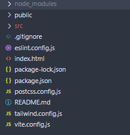

Vamos explorar a estrutura do projeto Vite criado com o comando `npm create vite@latest . -- --template react`.

### node_modules

Essa pasta é criada automaticamente pelo npm e contém todas as dependências do projeto.

### Public

- **`public/`**: Contém arquivos estáticos que não são processados pelo Vite, por exemplo imagens estáticas como favicon. A pasta `public` é servida como estática pelo Vite, sem precisar passar pelo processo de build.

### Src

- **`src/`**: Pasta principal para o código da aplicação (abreviação de source).
  - **`App.jsx`**: Componente principal da aplicação React. Contém a estrutura básica da interface e lógica de estado.
  - **`main.jsx`**: Ponto de entrada da aplicação. Renderiza o componente `App` dentro do elemento DOM com `id="root"` (parecido com o exemplo que mostramos anteriormente).
  - **`App.css`**: Estilos específicos para o componente `App`.
  - **`index.css`**: Estilos globais para a aplicação.
  - **`assets/`**: Diretório para armazenar ativos como imagens. Esses arquivos, por sua vez, serão processados pelo Vite, diferente da pasta `public`.
    - **`react.svg`**: Um exemplo de ícone SVG do React.

### Arquivos de Configuração

- **`index.html`**: Arquivo HTML principal que carrega a aplicação. Contém a `

` onde o React renderiza a aplicação.
- **`package.json`**: Define as dependências do projeto e scripts de execução, como `dev`, `build`, `lint`, e `preview`.
- **`vite.config.js`**: Configuração do Vite, incluindo plugins como o plugin React.
- **`eslint.config.js`**: Configuração do ESLint para garantir a qualidade do código, com regras específicas para React.
- **`.gitignore`**: Lista de arquivos e diretórios que devem ser ignorados pelo Git, como `node_modules` e `dist`.

## Dependências

- **`react` e `react-dom`**: Bibliotecas principais para construir interfaces de usuário com React.
- **`@vitejs/plugin-react`**: Plugin para integrar React com Vite, oferecendo suporte a recursos como Fast Refresh.
- **`eslint` e plugins relacionados**: Ferramentas para análise estática de código, garantindo que o código siga boas práticas e padrões.

## Scripts

- **`dev`**: Inicia o servidor de desenvolvimento com Vite.
- **`build`**: Compila a aplicação para produção.
- **`lint`**: Executa o ESLint para verificar o código.
- **`preview`**: Inicia um servidor para pré-visualizar a aplicação após a build.

Esta estrutura inicial é projetada para ser minimalista, permitindo que você comece rapidamente a desenvolver uma aplicação React com Vite, enquanto ainda oferece flexibilidade para personalizações futuras. Ou seja, você pode alterar a estrutura para atender as suas necessidades, criando novas pastas e arquivos.
