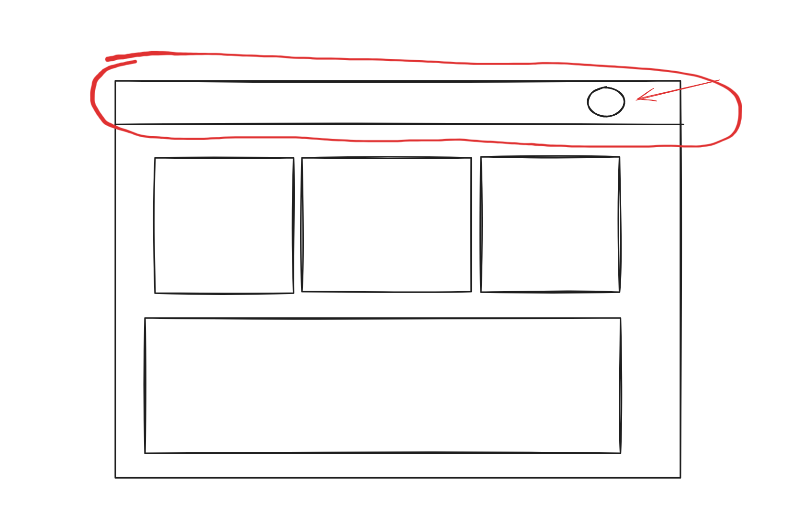

Se pensarmos em interfaces de usuário, podemos entender que elas podem ser divididas em pequenas partes ou blocos. Por exemplo, é comum que os sites possuam um _header_ ou _navbar_.

Além disso, é comum que essas pequenas partes sejam reutilizadas em diversas partes do site. Em um e-commerce, por exemplo, é comum que o _header_ seja o mesmo em todas as páginas. A mesma coisa de um carrinho de compras, que pode ser acessado em qualquer lugar do site.

O React chama essas pequenas partes de **componentes**. Ou seja, uma aplicação React é um conjunto de diversos componentes que comunicam entre si.

Todo componente pode ter outros componentes dentro de si. Por exemplo, a _navbar_ pode ter um _menu_ dentro de si.



Não existe um limite para a profundidade de componentes que podemos ter em uma aplicação React.

Todo app React vai começar com um componente principal, que normalmente é chamado de `App.jsx`. É como se ele fosse a "casca" de toda a aplicação.

A partir do `App.jsx`, vamos colocando dentro dele os outros componentes conforme a necessidade.

Eu gosto de fazer uma analogia com o corpo humano. O `App.jsx` é o nosso corpo, e os componentes são as nossas mãos, nossos pés, nossos olhos, etc.

```jsx
// Corpo.jsx

function Corpo() {
  return (
    <div>
      <Cabeça>
        <Olho />
        <Olho />
        <Nariz />
        <Boca />
      </Cabeça>
      <Tronco>
        <Braço />
        <Braço />
        <Perna />
        <Perna />
      </Tronco>
    </div>
  );
}
```

E daí você pode perceber que os componentes podem ter outros componentes dentro de si, por exemplo a _cabeça_ pode ter um _olho_ dentro de si, um _olho_ pode ter uma _pupila_ dentro de si e assim por diante.

## Dividindo componentes em componentes menores

Nesse ponto, você pode estar se perguntando: "Mas como eu vou saber quando criar um novo componente?".

E aqui entra um grande desafio: **não existe uma resposta definitiva para isso**.

O React não determina quantos componentes você deve ter em sua aplicação. Se você quiser pode criar todo o código dentro do `App.jsx`. Porém você já deve imaginar o caos que isso vai se tornar.

Então é interessante que você crie componentes menores que sejam mais organizados e que possam ser reutilizados quando necessário.

A técnica que eu utilizo eu gosto de chamar de **bom senso**. Você não quer ter um componente gigantesco que faz tudo, mas você também não quer ter centenas de micro-componentes que dificultam sua vida quando você precisar fazer uma manutenção no código.

Com o tempo e com experiência, você vai conseguir identificar melhor quando é necessário criar um novo componente. Mas essa é mais uma das coisas que não existe um jeito definitivo, vão ter pessoas diferentes que vão ter opiniões diferentes sobre isso.

Por isso eu gosto da ideia do **bom senso**.

Agora vamos analisar o app que vamos construir e planejar nossos primeiros componentes.
