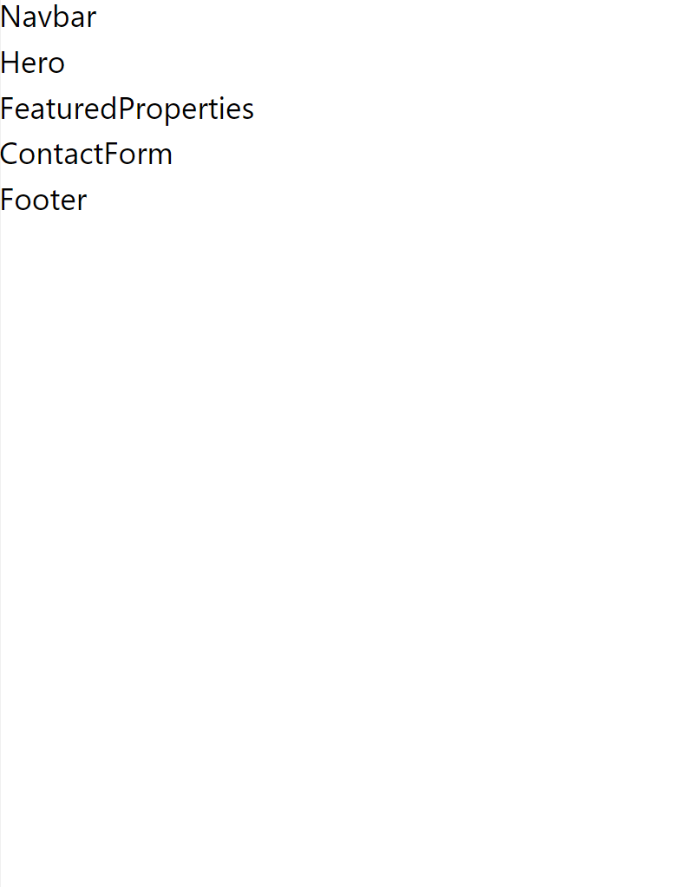

Vamos criar os arquivos apenas com uma estrutura básica para cada componente e ao longo das próximas aulas vamos adicionar o código necessário para cada um deles.

## Onde colocar os arquivos?

Você reparou que temos uma pasta `src` no projeto?

Esse é um padrão comum para projetos até em outras linguagens de programação. Por mais que possamos alterar essa estrutura, vamos seguir esse padrão, até para aproveitar a configuração que já vem com o Vite.

Agora dentro da pasta `src` você pode criar diferentes estruturas de pastas para armazenar seus componentes. Em projetos maiores, você pode ter uma pasta para cada funcionalidade da sua aplicação.

Um padrão que é mais simples e comum em projetos menores é criar uma pasta `components` e agrupar todos os seus componentes dentro dela. Vamos seguir esse padrão por enquanto.

> Se você quiser explorar padrões mais complexos, pode pesquisar na web sobre "react folder structure".

## Criando o primeiro arquivo

Dentro da pasta `components` vamos criar um arquivo para cada componente que vamos precisar.

Vamos começar com o `Navbar`. Crie o seguinte arquivo:

```jsx
// src/components/navbar.jsx

function Navbar() {
  return <div>Navbar</div>;
}

export default Navbar;
```

Repare em alguns detalhes:

### Nome do arquivo

Nesse caso, utilizei o nome `navbar.jsx` tudo minúsculo. Essa é uma opção pessoal. Eu gosto de utilizar esse padrão que é chamado de "kebab case" ou "dashed case", que seria: palavras minusculas separadas por hífens.

Então, se eu quiser criar um componente chamado `PropertyCard`, o arquivo seria `property-card.jsx`.

Outro padrão comum é o "Pascal Case", que seria: palavras começando com maiúsculas.

Então, se eu quiser criar um componente chamado `PropertyCard`, o arquivo seria `PropertyCard.jsx`.

O React não exige um padrão específico então você pode ver formas diferentes em diferentes projetos. Uma dica é sempre manter o padrão que você está utilizando para não ficar bagunçado.

### Nome do componente

Ao contrário do nome do arquivo, o nome do componente **deve** ser em Pascal Case. Essa é uma convenção do React que ajuda a diferenciar os componentes de outros elementos HTML.

Então, o meu componente de exemplo **deve** ser chamado `PropertyCard` e não `property-card` ou `propertyCard` ou `propertycard`.

### Estrutura básica (função)

Os componentes em React são basicamente funções que retornam JSX. Essas funções também recebem alguns parâmetros especiais que vamos ver em breve.

### Exportando o componente

Para utilizar o componente em outro arquivo, precisamos exportá-lo. Existem duas formas diferentes de fazer isso.

A primeira é o `export default`. Ele fará com que o componente seja exportado como o valor padrão do módulo. Então quando ele for importado, não precisaremos utilizar chaves. Da seguinte forma:

```jsx
import Navbar from "./components/navbar";
```

O segundo jeito de fazer é o `export` "sem default". Ficaria assim:

```jsx
function Navbar() {
  return <div>Navbar</div>;
}

export { Navbar };
```

ou até mesmo

```jsx
export function Navbar() {
  return <div>Navbar</div>;
}
```

Nesse caso, quando o componente for importado, precisaremos utilizar chaves. Da seguinte forma:

```jsx
import { Navbar } from "./components/navbar";
```

A principal diferença entre as duas formas é que o `export default` só pode ser utilizado uma vez em um arquivo, enquanto o `export` "sem default" pode ser utilizado quantas vezes quisermos. Então se tivermos vários componentes em um mesmo arquivo, podemos utilizar o `export` "sem default".

Inicialmente, vamos padronizar em utilizar o `export default` para simplificar o entendimento. Mas é legal saber que existe essa outra forma de exportar componentes.

> Um detalhe importante é que essa funcionalidade é do JavaScript e não do React.

---

## Criando os outros arquivos

Vamos para o próximo componente: `Hero`.

Crie o arquivo `hero.jsx` e adicione o seguinte código:

```jsx
// src/components/hero.jsx

function Hero() {
  return <div>Hero</div>;
}

export default Hero;
```

Agora vamos para o `FeaturedProperties`.

```jsx
// src/components/featured-properties.jsx

function FeaturedProperties() {
  return <div>FeaturedProperties</div>;
}

export default FeaturedProperties;
```

Agora o `ContactForm`.

```jsx
// src/components/contact-form.jsx

function ContactForm() {
  return <div>ContactForm</div>;
}

export default ContactForm;
```

Por último, o `Footer`.

```jsx
// src/components/footer.jsx

function Footer() {
  return <div>Footer</div>;
}

export default Footer;
```

Por fim, vamos adicionar tudo isso no `App.jsx`. Vamos aproveitar e colocar algumas classes para a estrutura da nossa página.

```jsx
// src/App.jsx

import Navbar from "./components/navbar";
import Hero from "./components/hero";
import FeaturedProperties from "./components/featured-properties";
import ContactForm from "./components/contact-form";
import Footer from "./components/footer";

function App() {
  return (
    <div className="flex flex-col">
      <Navbar />
      <Hero />
      <FeaturedProperties />
      <ContactForm />
      <Footer />
    </div>
  );
}
```

Agora sua página deverá exibir o seguinte:



Agora vamos aprender um pouco mais sobre JSX antes de implementar as funcionalidades de cada componente.
