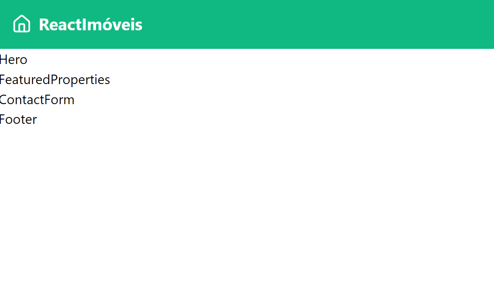

Vamos começar por nossa navbar.

Para a logo do nosso app, vamos usar uma biblioteca de ícones chamada lucide-icons. Então, primeiro, vamos instalar ela:

```bash
npm install lucide-react
```

Depois vamos alterar o arquivo `src/components/navbar.jsx` para adicionar a logo e os estilos.

```jsx
// src/components/navbar.jsx

import { Home } from "lucide-react";

function Navbar() {
  return (
    <header className="bg-emerald-500 text-white p-4">
      <div className="container mx-auto flex justify-between items-center">
        <div className="flex items-center space-x-2">
          <Home className="h-6 w-6" />
          <span className="text-xl font-bold">ReactImóveis</span>
        </div>
      </div>
    </header>
  );
}

export default Navbar;
```

Repare que a biblioteca lucide-react exporta cada ícone como um componente React. Então, para usar o ícone `Home`, usamos `<Home />` e podemos passar uma classe CSS para estilizar ele, no caso estamos usando algumas classes do Tailwind.

Agora sua aplicação deve ter um header com a logo e o nome do app.


