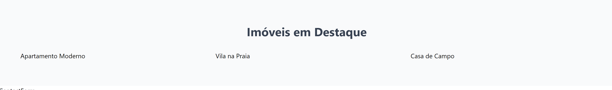

Agora vamos implementar o componente FeaturedProperties que vai listar os imóveis mais em destaque. Vamos dividir essa implementação em duas etapas: primeiro vamos criar a estrutura e depois vamos implementar o card.

Vamos começar alterando o arquivo `src/components/featured-properties.jsx` e criando a estrutura básica.

```jsx
// src/components/featured-properties.jsx

function FeaturedProperties({ properties }) {
  return (
    <section className="py-16 bg-gray-50">
      <div className="container mx-auto">
        <h2 className="text-3xl font-bold mb-8 text-center text-gray-700">
          Imóveis em Destaque
        </h2>
        <div className="grid grid-cols-1 md:grid-cols-2 lg:grid-cols-3 gap-8 px-12">
          {/* propriedades */}
        </div>
      </div>
    </section>
  );
}

export default FeaturedProperties;
```

Observe que aqui temos uma pequena diferença dos outros componentes. A função do componente recebe um parâmetro chamado `properties`. Esse parâmetro é o que chamamos de `props` no React. As `props` são informações relativas ao componente que podem ser passadas para ele pelo componente "pai".

Então nesse caso, a prop `properties` será passada pelo componente `App`. Nós vamos fazer dessa forma, porque os nossos dados serão buscados a partir do componente `App` e depois "distribuídos" para os componentes filhos.

Vamos aprender um pouco mais sobre `props` quando formos criar o componente `PropertyCard`.

### Passando props

Agora vamos passar a prop no componente `App` para o componente `FeaturedProperties`.

Vá até o arquivo `src/App.jsx` e adicione a variável `properties` fora do componente. Em breve vamos simular uma API para buscar os dados, mas por enquanto vamos colocá-los direto no código.

```jsx
import Navbar from "./components/navbar";
import Hero from "./components/hero";
import FeaturedProperties from "./components/featured-properties";
import ContactForm from "./components/contact-form";
import Footer from "./components/footer";

const properties = [
  {
    id: 1,
    name: "Apartamento Moderno",
    description: "Um belo apartamento moderno no centro da cidade",
    location: "Centro",
    price: 250000,
    image: "src/assets/properties/1.webp",
    featured: true,
  },
  {
    id: 2,
    name: "Vila na Praia",
    description: "Vila luxuosa com vista deslumbrante para o oceano",
    location: "Área Costeira",
    price: 750000,
    image: "src/assets/properties/2.webp",
    featured: true,
  },
  {
    id: 3,
    name: "Casa de Campo",
    description: "Espaçosa casa familiar com um grande quintal",
    location: "Interior",
    price: 450000,
    image: "src/assets/properties/3.webp",
    featured: false,
  },
];

export default function App() {
  return (
    <div>
      <Navbar />
      <Hero />
      <FeaturedProperties properties={properties} />
      <ContactForm />
      <Footer />
    </div>
  );
}
```

Observe que passar `props` é muito similar a passar atributos HTML.

### Recebendo props

Agora de volta ao componente `FeaturedProperties`, vamos utilizar a prop `properties` que foi passada pelo componente `App`.

Sabemos que essa variável é uma lista (array) contendo objetos que representam cada imóvel. Então podemos iterar sobre ela utilizando o método `map`.

```jsx
// src/components/featured-properties.jsx

function FeaturedProperties({ properties }) {
  return (
    <section className="py-16 bg-gray-50">
      <div className="container mx-auto">
        <h2 className="text-3xl font-bold mb-8 text-center text-gray-700">
          Imóveis em Destaque
        </h2>
        <div className="grid grid-cols-1 md:grid-cols-2 lg:grid-cols-3 gap-8 px-12">
          {properties.map((property) => (
            <div key={property.id}>{property.name}</div>
          ))}
        </div>
      </div>
    </section>
  );
}

export default FeaturedProperties;
```

Com isso, a lista de imóveis será exibida na tela, porém estamos exibindo temporariamente apenas o nome de cada imóvel. Na próxima etapa vamos criar o componente `PropertyCard` para exibir cada imóvel de forma mais detalhada.


