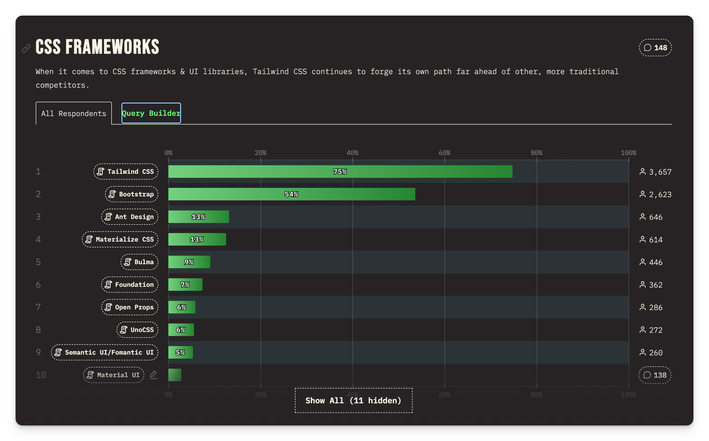
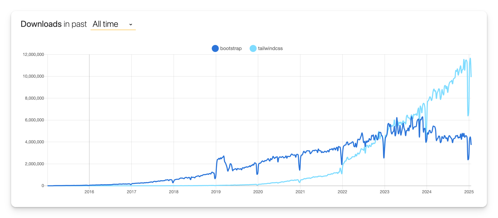

Se você ainda nunca usou o TailwindCSS provavelmente se pergunta o que exatamente é toda a *hype* ao redor do Workshop.

Afinal de contas, o código *fica feio pra caramba*. Mas um *spoiler* aqui: No fim a gente acaba gostando disso tudo 🙄.

### Definição técnica

 A definição técnica do TailwindCSS é que ele é um framework CSS baseado em classes de utilidades (*utility classes*).

O Tailwind pode substituir, por exemplo, o [Bootstrap](https://getbootstrap.com/). Ou ainda, **coexistir** com esses frameworks - pois, a princípio, não há colisão de classes (e se houver, você pode configurar um *prefixo* para as classes do tailwind - por exemplo `tw-bg-white`)

### Por que TailwindCSS?

Existem várias vantagens que poderiam ser listadas para se usar TailwindCSS. Mas pra mim a mais importante é a *velocidade* e *produtividade* que o framework proporciona para quem está usando.

Resumo da ópera - é muito mais fácil escrever CSS usando Tailwind. E mais - aqui uma opinião polêmica - acho que o TailwindCSS **não apenas será um framework mas a forma moderna de escrever a web**.

Apenas para não deixar passar, outras vantagens do TailwindCSS são:

#### Outras Vantagens

- Padronização do CSS - Fácil manutenção
- Tamanho final do CSS - Performance 🚀
- Menos troca de contexto
- Consistência visual (valores de cores e tamanhos padronizados)
- Responsividade é fácil
- É agnóstico de framework
- Altamente customizável
- Perfeito para componentização
- Evita conflito de classes
- Dark mode é *beautiful* de codar
- Zero dependências
- Acessibilidade (`sr-only`)
- Documentação maravilhosa
- Você ainda aprende CSS usando o Tailwind!

#### Todo mundo está usando

Se você ainda não se convenceu, talvez os números te convençam:

**State of CSS 2024**

**NPM Trends**

