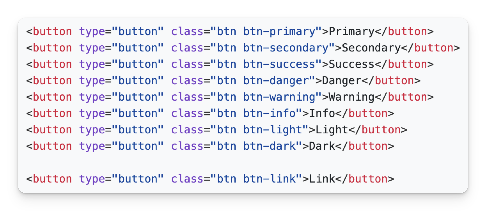

Não existem componentes no TailwindCSS. Você não vai encontrar uma classe `btn`, `button` ou similar.

Aquele CSS abaixo? Esqueça.

**A única coisa que o Tailwind fornece pra gente são classes. E só.**

### As classes do TailwindCSS são todas *utilitárias*

Além de ser um framework de classes, as classes do TailwindCSS têm algumas especificidades:

1. São específicas, ou seja, possuem um único propósito.
2. São reutilizáveis.
3. Dispensam o uso de arquivos `.css`.

### Quer dizer que não vou precisar mais criar arquivos `.css`?

Exatamente, não vai mais precisar.

### Quer dizer que eu não vou criar mais uma classe `btn` para meus botões?

Exatamente, não vai mais criar.

### Como eu vou criar meu botão então?

Aí é que o TailwindCSS brilha 💫.

A web hoje é *componentizada*, por mais que o HTML e o CSS tradicional não sejam. É muito difícil hoje um website grande que não use algum recurso de componentização.

Com a ideia de componentização vem a ideia de encapsulamento também: cada componente tem não apenas a estrutura semântica (HTML), mas também a estrutura de estilização (CSS).

E já que muito provavelmente um botão será um componente, na verdade, **você não precisa de uma classe botão, você precisa de um componente botão**!
