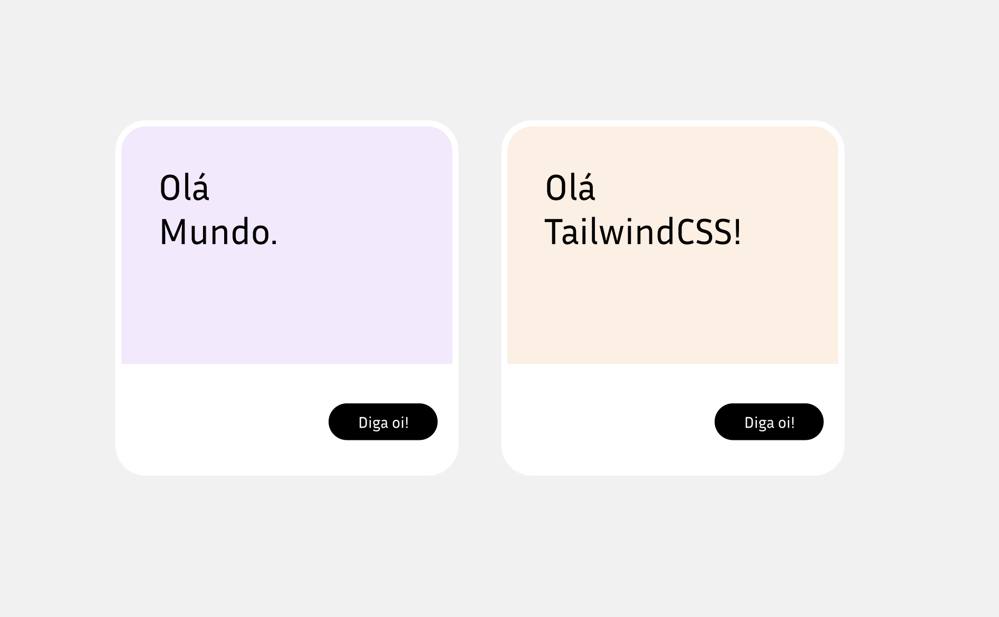

Podemos explorar de forma inicial o Tailwind usando o *Tailwind Playground*:

<https://play.tailwindcss.com>

Podemos começar por lá a entender como é que funciona esse novo framework.

## Exercício 01

Crie dois cards iguais aos que estão na imagem abaixo. Vamos usar, nesse momento, apenas o Tailwind Playground, ok?

E, se não souber como fazer, tudo bem. A gente ainda nem começou praticamente o workshop. Vamos resolver juntos. A ideia desse exercício é apenas você entender mais ou menos o "fluxo" de código do TailwindCSS.

## Resolução 01

O legal do Playground também é que o código é compartilhável pela URL, então podemos enviar para qualquer pessoa aquilo que prototipamos simplesmente copiando a URL.

<!-- TODO: Resolução do exercício 01 -->
