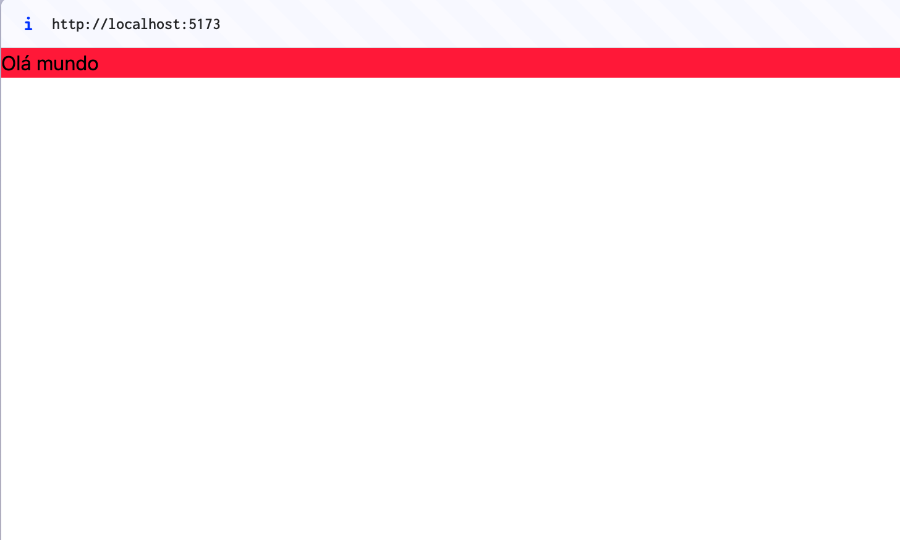

Vamos agora instalar um projeto simples com TailwindCSS.

Não vou focar muito na instalação do projeto aqui, uma vez que, para cada framework, há uma documentação para instalação.

Para todos os nossos exercícios, vamos usar o Vite com HTML simples.

### Criando o projeto com Vite

Para isso, vamos criar nosso HTML:

```bash
mkdir vite-tailwindcss
```

Depois, vamos iniciar um projeto com npm:

```bash
npm init -y
```

E, por fim, instalar o vite:

```bash
npm i vite -D
```

Vamos criar um `index.html` na raiz do projeto e, no nosso `package.json`, inserir o seguinte na seção de `scripts`:

```json
// package.json
  "scripts": {
    "dev": "vite dev"
  },
```

Agora, basta colocarmos algum conteúdo no nosso `index.html` e rodar o script `npm run dev`.

```html
<!-- index.html -->
<!DOCTYPE html>
<html lang="en">
  <head>
    <meta charset="UTF-8" />
    <meta name="viewport" content="width=device-width, initial-scale=1.0" />
    <title>Document</title>
  </head>
  <body>
    <h1>Olá mundo</h1>
  </body>
</html>
```

O servidor dev deverá servir nossa página:


### Instalando o TailwindCSS

Agora, vamos seguir a instalação para o Tailwind e Vite que está [nessa página](https://tailwindcss.com/docs/installation/using-vite).

Vamos instalar dois pacotes: `tailwindcss` e `@tailwindcss/vite`.

```bash
npm i tailwindcss @tailwindcss/vite
```

Vamos adicionar um arquivo de *config* do Vite:

```javascript
// vite.config.js
import { defineConfig } from 'vite'
import tailwindcss from '@tailwindcss/vite'
export default defineConfig({
  plugins: [
    tailwindcss(),
  ],
})
```

Vamos criar agora um arquivo de CSS. Podemos chamá-lo de `tailwind.css` e, dentro, vamos simplesmente importar o nosso pacote:

```css
@import 'tailwindcss';
```

E não vamos esquecer de fazer o link com nosso CSS:

```html ins={8}
<!-- index.html -->
<!DOCTYPE html> 
<html lang="en">
  <head>
    <meta charset="UTF-8" />
    <meta name="viewport" content="width=device-width, initial-scale=1.0" />
    <title>Document</title>
    <link href="./tailwind.css" rel="stylesheet" />
  </head>
  <body>
    <h1 class="bg-red-500">Olá mundo</h1>
  </body>
</html>
```

Se o nosso "Olá Mundo" está com um fundo vermelho, então nosso Tailwind está funcionando perfeitamente!



### Instalando a extensão oficial do TailwindCSS

Uma das ferramentas mais indispensáveis para se usar quando estamos trabalhando com TailwindCSS e código é a [extensão oficial do Tailwind Intellisense](https://marketplace.visualstudio.com/items?itemName=bradlc.vscode-tailwindcss).

Basta instalar que ela traz algumas coisas importantes:

- Autocomplete
- Lint (mostra erro quando a classe está em conflito, errada)
- Preview do CSS puro no hover
- Uma nova linguagem para o VSCode: ao invés do CSS, você pode escolher a linguagem TailwindCSS que não dá erro com as diretivas específicas do Tailwind.

### Configurando o Prettier com o TailwindCSS

Vamos instalar um plugin do Prettier:

```bash
npm install -D prettier prettier-plugin-tailwindcss
```

Depois, basta criarmos um arquivo `.prettierrc` e adicionarmos o nosso plugin:

```json
// .prettierrc
{
  "plugins": ["prettier-plugin-tailwindcss"]
}
```
