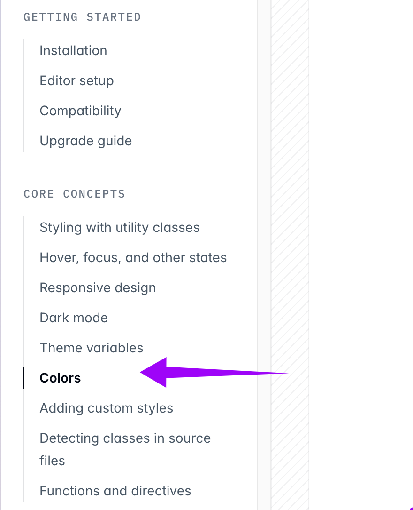
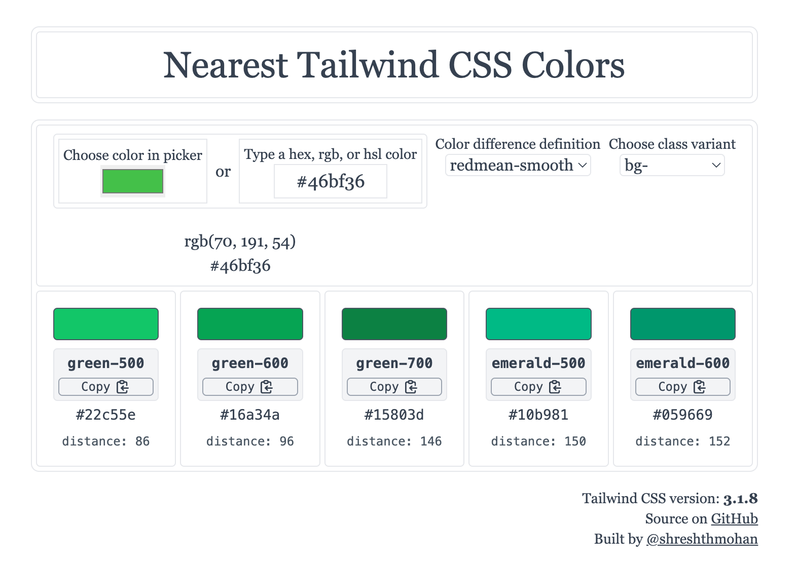

Uma das grandes vantagens do TailwindCSS é que ele traz para gente um sistema de padrões sensatos. Isso significa que não precisamos pensar muito em pequenas tomadas de decisão em UI: a equipe já fez isso para nós

### Cores são um estudo à parte

Cores são difíceis. Se você não acha ou (i.) você é um gênio; ou (ii.) ainda não se aprofundou suficientemente.

Criar uma paleta de cores *pode* parecer ser uma tarefa matemática: você tem a roda de cores (*color wheel*) e vai ajustando alguns valores: brilho, saturação, luminosidade, matiz, chroma ... bem parece que já começou a compliar.

Mas para piorar, cores **definitivamente não são uma questão totalmente matemática**

**Vou dar um exemplo:**
Imagine que queremos fazer uma paleta hipotética de cores azul com apenas 3 cores. Azul claro, azul médio e azul escuro. A gente pode brincar com os valores, até chegar em um padrão: Azul claro: 20% opacidade, azul médio: 50% opacidade, azul escuro: 80% opacidade. Ótimo temos nossa paleta de cores.

Mas aí, mudamos de ideia, a cor principal não mais vai ser azul, vai ser amarelo.

E o que parecia certo, agora parece totalmente errado! O amarelo é uma das cores "terríveis" no design - parece que nada fica bom - tenta adicionar contraste e acessibilidade então!?

Vieram outros cálculos de cores para tentar resolver alguns desses problemas (por exemplo o  HSL, depois o LCH e o OKLCH). Mas ainda assim existem peguinhas/gotchas.

**O resumo da ópera:**
Criar uma paleta de cores de forma matemática não é simples (ou possível?).

### Mas por que falar tudo isso?

Tudo isso pra falar que o TailwindCSS já investiu uma boa parte de temas em otimizar uma série de cores para utilizarmos em nossos projetos.

<https://tailwindcss.com/docs/colors>

Cores, pro TailwindCSS é tão importante que faz parte de um "core concept" (conceito principal) da documentação!

Vamos, nesse workshop, usar as cores do TailwindCSS.

### A paleta do TailwindCSS

No Tailwind cada cor possui 11 tonalidades que são classificadas com números que vão do 50 até o 950. as tonalidades existentes são:

- `50` (mais clara)
- `100`
- `200`
- `300`
- `400`
- `500` (cor clássica - geralmente a brand color)
- `600`
- `700`
- `800`
- `900`
- `950` (mais escura)

Cada uma  das cores possui um nome.

- `red`
- `orange`
- `amber`
- `yellow`
- `lime`
- `green`
- `emerald`
- `teal`
- `cyan`
- `sky`
- `blue`
- `indigo`
- `violet`
- `purple`
- `fuchsia`
- `pink`
- `rose`
- `slate`
- `gray`
- `zinc`
- `neutral`
- `stone`

Para usar as cores basta usar a classe que é uma combinação do nome da cor com o número da tonalidade, exemplo `fuchsia-500`.

### Dica Nearest Tailwind Color

A não ser que haja um requerimento muito explícito e específico no projeto, eu sempre uso as cores do Tailwind - mesmo com o design no Figma estabelecendo outra cor.

Isso porque a paleta de cores do Tailwind é tão abrangente que é difícil o caso de você precisar criar outra cor.

Para converter uma cor qualquer para a cor do Tailwind mais próxima uso uma (das várias diponíveis) ferramenta chamada [find nearest color](https://nearest-tailwind-color.netlify.app/).

Basicamente o que a ferramenta faz é: você coloca o input (em hexadecimal rgb ou qualquer formato) e o output é uma classe do tailwindCSS.

