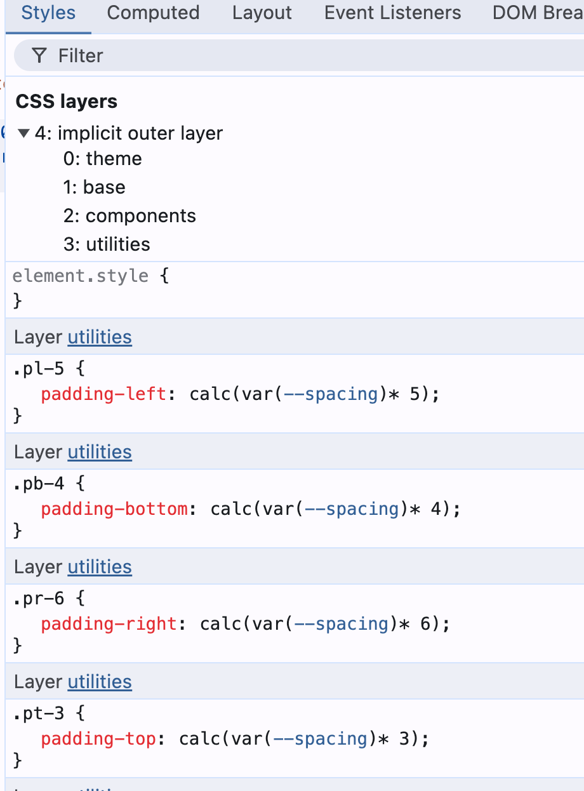
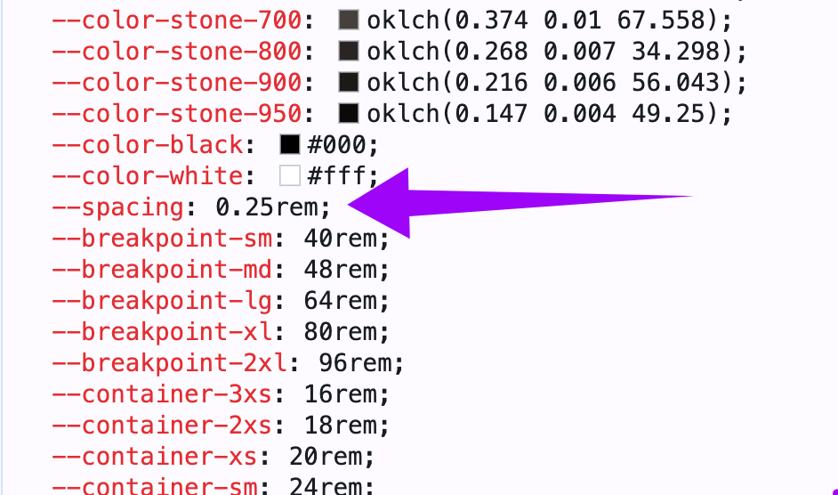
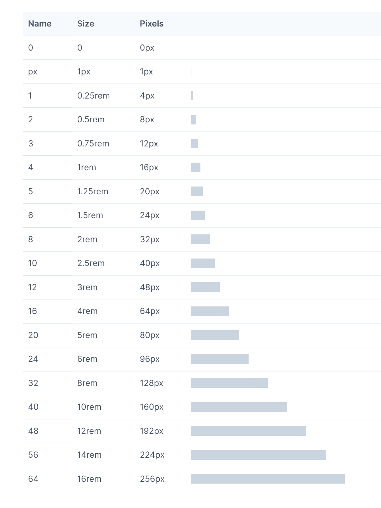

Da mesma forma que as cores, os sistemas de medidas do TailwindCSS são pré definido. E o mesmo argumento que fizemos lá, também faremos aqui: é melhor usar os padrões do TailwindCSS porque eles já foram "pensados" com cuidado antes.

No tailwind para tudo que envolve medida podemos utilizar basicamente 4 tipos de escalas/sistemas:

- Escala numérica de espaçamento
- Escala percentual
- Escala de "container"
- Escala de "viewport"

### Escala numérica de espaçamento

Aqui é a escala básica utilizada para espaçamentos como **padding** e **margin**.

Vamos dar uma olhada no nosso DevTools para ver como é que funciona a coisa. Vamos colocar uns paddings e margins quaisquer e ver o que é que cada classe

Veja que, para cada unidade de espaçamento, estamos usando uma variável chamada `--spacing` e multiplicando pelo valor.

Essa variável `--spacing` é igual a `0.25rem`:

E, tradicionalmente, `1rem = 4px`, de forma que cada unidade de espaçamento padrão do Tailwind é igual a `4px`.

Vale a pena ver a [página de espaçamento padrão da documentação](https://v1.tailwindcss.com/docs/customizing-spacing#default-spacing-scale):

Na documentação está até 64, mas ainda existem os valores 72, 80 e 96!

Maravilha, com isso em mente, vamos começar a codar!

### Escala de Porcentagem

Serve para uma porcentagem relativa ao elemento pai. Aqui você usa frações, por exemplo: `w-1/4`.

### Escala de Container

Também é possível usar um sistema de medidas de container. O sistema é o seguinte:

- `w-3xs`: 16rem (256px)
- `w-2xs`: 18rem (288px)
- `w-xs`: 20rem (320px)
- `w-sm`: 24rem (384px)
- `w-md`: 28rem (448px)
- `w-lg`: 32rem (512px)
- `w-xl`: 36rem (576px)
- `w-2xl`: 42rem (672px)
- `w-3xl`: 48rem (768px)
- `w-4xl`: 56rem (896px)
- `w-5xl`: 64rem (1024px)
- `w-6xl`: 72rem (1152px)
- `w-7xl`: 80rem (1280px)

:::tip
Eu geralmente uso o sistema de container quando quero dar largura para itens grandes, como cards, elementos grandes na página. Para esses itens, o tamanho de 96 (384px) é insuficiente 🙄
:::

### De acordo com viewport

Você pode usar uma escala de acordo com o `viewport`. O mais tradicional é usar o `*-screen` que é o tamanho total do viewport (ele dinamicamente escolhe o viewport horizontal ou vertical dependendo da propriedade que você irá utilizar, por exemplo, `w-screen` ou `h-screen`).

:::tip
Eu particularmente uso *muito* a classe `min-h-screen` quando quero que, por exemplo, uma cor de background fique em toda a tela - mesmo quando o conteúdo é menor do que a tela.
:::

Existem outras possibilidades, porém menos utilizadas (vou apenas citar aqui)

- `*-dvh` - viewport dinâmico (altura)
- `*-svh` - menor altura do viewport dinâmico
- `*-lvh` - maior altura do viewport dinâmico
- `*-dvw` - viewport dinâmico (largura)
- `*-svw` - menor largura do viewport dinâmico
- `*-lvw` - maior largura do viewport dinâmico
