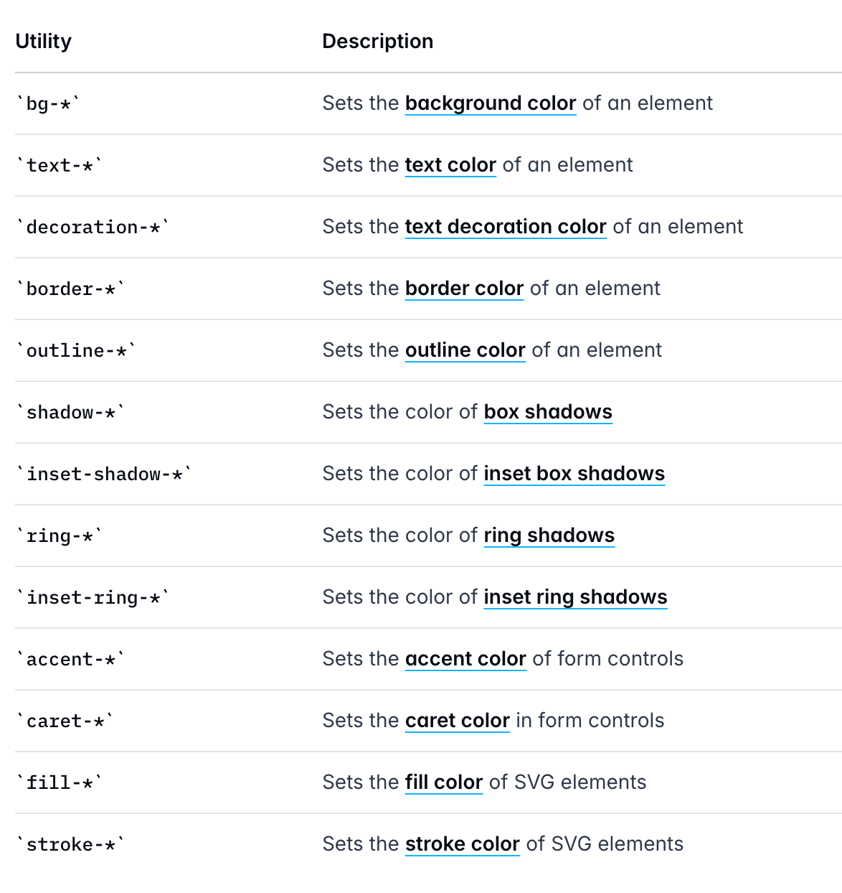
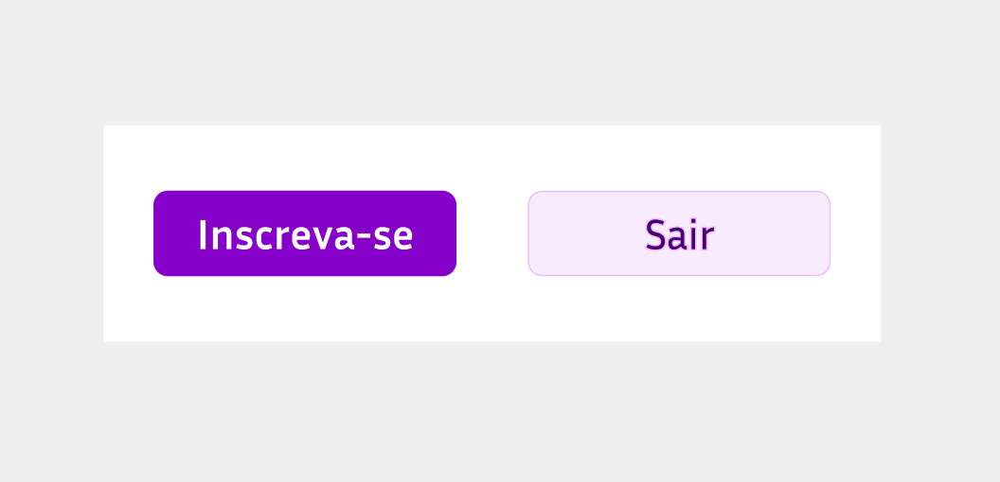

O "Hello World" de qualquer CSS é mudar a cor - seja da borda, seja do fundo/background.

- Para mudar a cor do fundo, usamos a classe: `bg-*`.
- Para mudar a cor do texto, usamos a classe `text-*`.
- Para mudar a cor de uma borda, usamos a classe `border-*`.

Lembre-se de que essas classes devem ser utilizadas em conjunto com as cores, por exemplo, `bg-red-500`.

A documentação mostra todas as classes que usam cores [neste link](https://tailwindcss.com/docs/colors#using-color-utilities):



### Exercício 02

Temos dois botões e precisamos deixá-los iguais ao design abaixo:

<!-- TODO pegar o FIGMA -->



Copie e cole o código abaixo em um arquivo novo chamado `exercicio02.html`.

```html
<>
```

### Resolução do Exercício 02

<!-- TODO: Fazer -->
