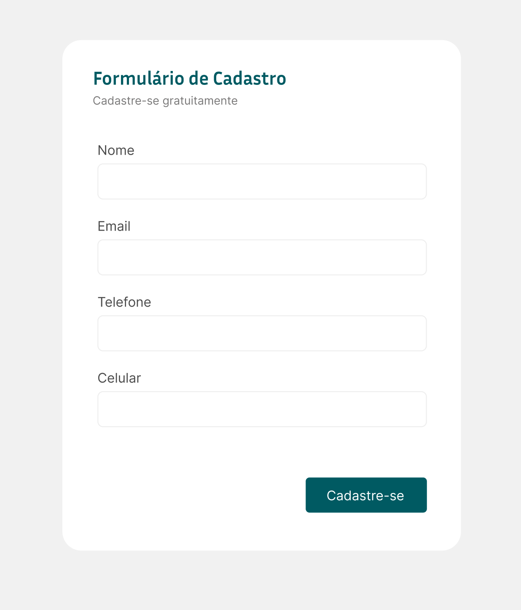

Se a cor é o primeiro passo na prototipação do CSS, os espaçamentos são o segundo.

Aqui temos dois tipos de classes utilitárias que usamos: `margin` e `padding`. Para elas, as classes são `m` e `p`, respectivamente.

Para elas, podemos definir:

1. O espaçamento de todos os 4 lados, usando `p-*`, `m-*` em que `*` substituímos pelo sistema de medidas.
2. O espaçamento do eixo horizontal (`px-*`, `mx-*`) ou do eixo vertical (`py-*`, `my-*`).
3. O espaçamento de apenas um dos lados:
   1. `pr-*`, `mr-*` (direita - right)
   2. `pl-*`, `ml-*` (esquerda - left)
   3. `pt-*`, `mt-*` (topo - top)
   4. `pb-*`, `mb-*` (base - bottom)

#### Margens Negativas

No TailwindCSS, é possível usar margens negativas (`-m-*`). Por exemplo, `-mt-4` aplica uma margem superior negativa de -16px, puxando o elemento para cima.

### Exercício 03a

O mesmo exercício que o anterior, só que dessa vez vamos usar `margin` e `padding`.

#### Código Inicial

```html
<!-- exercicios/03a-inicio -->
<!doctype html>
<html lang="en">
  <head>
    <meta charset="UTF-8" />
    <meta name="viewport" content="width=device-width, initial-scale=1.0" />
    <title>Exercício 02</title>
    <link href="../tailwind.css" rel="stylesheet" />
  </head>
  <body class="flex min-h-screen items-center justify-center bg-gray-100">
    <div class="rounded bg-white">
      <button class="rounded bg-fuchsia-800 text-white">Inscreva-se</button>
      <button
        class="rounded border border-fuchsia-300 bg-fuchsia-200 text-fuchsia-900"
      >
        Sair
      </button>
    </div>
  </body>
</html>
```

#### Resolução do Exercício 03a

```html
<!-- exercicios/03a-final -->
<!doctype html>
<html lang="en">
  <head>
    <meta charset="UTF-8" />
    <meta name="viewport" content="width=device-width, initial-scale=1.0" />
    <title>Exercício 02</title>
    <link href="../tailwind.css" rel="stylesheet" />
  </head>
  <body class="flex min-h-screen items-center justify-center bg-gray-100">
    <div class="flex gap-4 rounded bg-white px-10 py-6">
      <button class="rounded bg-fuchsia-800 px-6 py-2 text-white">
        Inscreva-se
      </button>
      <button
        class="rounded border border-fuchsia-300 bg-fuchsia-200 px-6 py-2 text-fuchsia-900"
      >
        Sair
      </button>
    </div>
  </body>
</html>
```

### Exercício 03b

Copie e cole o HTML abaixo em um arquivo novo chamado `exercicio03.html`.

Precisamos deixar o formulário mais ou menos igual à imagem abaixo. Utilize as classes de espaçamento para isso.



Dessa vez o código vai ser mais simples, sem os formulários e os botões, apenas com a `div` interna branca. Você deverá montar todo o restante.

#### Código inicial do Exercício 03b

```html
<!-- exercicios/03b-inicio -->
<!doctype html>
<html lang="en">
  <head>
    <meta charset="UTF-8" />
    <meta name="viewport" content="width=device-width, initial-scale=1.0" />
    <title>Exercício 03b</title>
    <link href="../tailwind.css" rel="stylesheet" />
  </head>
  <body class="flex min-h-screen items-center justify-center">
    <div class="bg-white"></div>
  </body>
</html>

```

#### Resolução do Exercício 03b

```html
<!-- exercicios/03b-final -->
 <!doctype html>
<html lang="en">
  <head>
    <meta charset="UTF-8" />
    <meta name="viewport" content="width=device-width, initial-scale=1.0" />
    <title>Exercício 03b</title>
    <link href="../tailwind.css" rel="stylesheet" />
  </head>
  <body class="flex min-h-screen items-center justify-center bg-gray-200">
    <div class="flex min-w-md flex-col rounded-xl bg-white p-10">
      <h2 class="font-display text-2xl font-bold text-teal-800">
        Formulário de Cadastro
      </h2>
      <p class="text-sm text-gray-500">Cadastre-se gratuitamente</p>
      <div class="my-12 flex flex-col space-y-6">
        <div class="flex flex-col">
          <label class="mb-1 text-sm text-gray-600" for="name">Nome</label>
          <input
            class="rounded-lg border border-gray-300 px-2 py-2.5"
            id="name"
            type="text"
          />
        </div>
        <div class="flex flex-col">
          <label class="mb-1 text-sm text-gray-600" for="email">Email</label>
          <input
            class="rounded-lg border border-gray-300 px-2 py-2.5"
            id="email"
            type="email"
          />
        </div>
        <div class="flex flex-col">
          <label class="mb-1 text-sm text-gray-600" for="phone">Telefone</label>
          <input
            class="rounded-lg border border-gray-300 px-2 py-2.5"
            id="phone"
            type="text"
          />
        </div>
        <div class="flex flex-col">
          <label class="mb-1 text-sm text-gray-600" for="mobile">Celular</label>
          <input
            class="rounded-lg border border-gray-300 px-2 py-2.5"
            id="mobile"
            type="text"
          />
        </div>
      </div>
      <button class="self-end rounded bg-teal-800 px-6 py-2 text-white">
        Inscreva-se
      </button>
    </div>
  </body>
</html>

```
