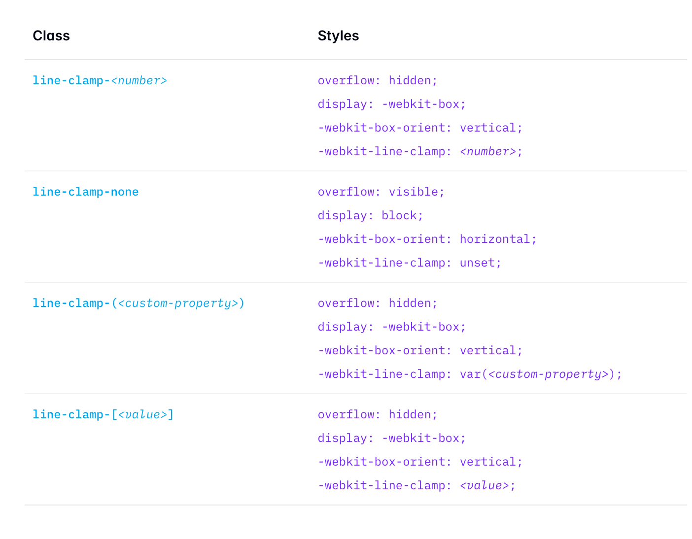
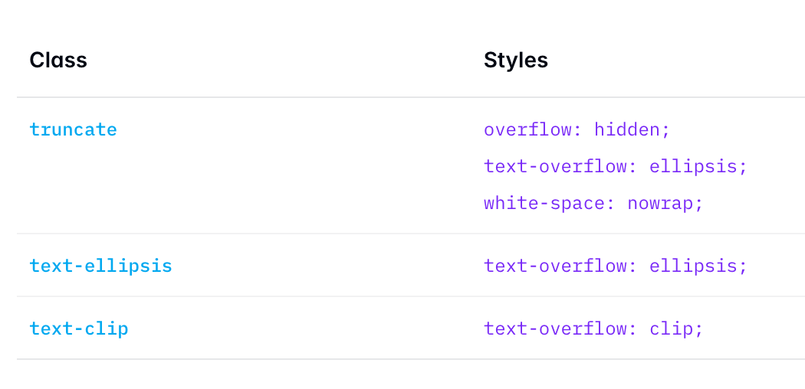

Além das tradicionais classes utilitárias, o TailwindCSS também traz para nós algumas classes que fazem mais do que uma coisa - mas em casos bem específicos em que a solução nativa não é tão elegante.

Essas classes *mágicas* nada mais são do que um encapsulamento de padrões comuns de estilo e layout. Usar elas reduz seu código e deixa ele mais limpo e fácil de manter.

### A classe `container`

A classe [container](https://tailwindcss.com/docs/max-width#using-breakpoints-container) nada mais faz do que aplicar um `width` de `100%` e limita o tamanho máximo dependendo do breakpoint em que está.

É uma forma simples de deixar seu conteúdo responsivo baseado em um *set* limitado de tamanhos.

Lembrando que, diferentemente do *bootstrap* ou outras libs, o *container* do Tailwind não centraliza o conteúdo com `mx-auto` nem aplica `padding`. Isso ainda deverá ser feito manualmente.

### A classe `size-*`

É muito comum redimensionar *ambos* largura e altura ao mesmo tempo - especialmente quando trabalhamos com ícones.

Ao invés de fazer: `w-10 h-10` você pode simplesmente escrever `size-10`, que ambos os tamanhos serão redimensionados automaticamente.

### A classe `divide`

A classe `divide` é uma maneira mais simples de adicionar bordas apenas entre elementos filhos.

Esse padrão é bem conhecido (e levemente desafiador no CSS): Você precisa criar uma divisória entre os elementos - ou seja, aplicar bordas apenas no "meio" dos elementos.

O problema é que você precisa saber qual é o primeiro e qual é o último filho para remover a borda `top` do primeiro ou remover a borda `bottom` do último (ou, no caso de elementos horizontais, `left` e `right`, respectivamente).

Em vez de adicionar bordas em cada elemento e depois remover a borda do último (ou primeiro) filho com pseudo-seletores complexos, você pode usar as classes `divide-{direção}-{tamanho}`. Por exemplo, `divide-y-2` adicionará uma borda de `2px` na parte superior de todos os filhos, exceto o primeiro, criando divisórias verticais. Da mesma forma, `divide-x-4` criaria divisórias horizontais com uma borda de `4px`. Você também pode controlar a cor da borda com `divide-{cor}`.

### A classe `space-*`

Semelhante ao `divide`, `space-*` é projetado para adicionar espaçamento entre elementos filhos, mas em vez de bordas, ele adiciona margens. `space-y-4` adicionará `margin-top: 1rem` (4 unidades no Tailwind) a todos os filhos, exceto o primeiro, criando espaçamento vertical.

O `space-x-2` faria o mesmo horizontalmente, adicionando `margin-left: 0.5rem` (2 unidades) entre os elementos. Essa abordagem é muito mais limpa do que adicionar margens manualmente a cada elemento e se preocupar com o primeiro ou último filho.

### A classe `line-clamp-*`

A classe `line-clamp-*` resolve um problema muito comum na web: truncar texto em várias linhas de forma elegante. Anteriormente, isso exigia truques de CSS complicados envolvendo `-webkit-line-clamp`, `display: -webkit-box`, e `-webkit-box-orient`. Com Tailwind, basta adicionar `line-clamp-{número}`. Por exemplo, `line-clamp-3` limitará o texto a três linhas e adicionará reticências `(...)` no final.



### A classe `truncate`

truncate é a versão de linha única de `line-clamp`. Ele simplesmente corta o texto que ultrapassa a largura do *container* com reticências `(...)`. Ele é um atalho para as propriedades CSS `overflow: hidden`, `text-overflow: ellipsis`, e `white-space: nowrap`. Serve em situações que você tem um espaço limitado e precisa garantir que o texto não quebre o layout.



### A classe `sr-only`

A classe `sr-only` é importante para acessibilidade. Ela esconde visualmente um elemento, mas o mantém acessível para leitores de tela.

A classe aplica um conjunto de propriedades CSS que remove o elemento do fluxo visual, mas o mantém no DOM e acessível para tecnologias assistivas. O contrário dessa classe, not-sr-only, reverte esse efeito, tornando o elemento visível novamente.

O CSS gerado pela classe é esse:

```CSS
.sr-only {
  position: absolute;
  width: 1px;
  height: 1px;
  padding: 0;
  margin: -1px;
  overflow: hidden;
  clip: rect(0, 0, 0, 0);
  white-space: nowrap;
  border-width: 0;
}
```

### Gradientes

As classes seguem o padrão `bg-linear-to-{direção}`, onde `{direção}` pode ser `t` (top), `b` (bottom), `l` (left), `r` (right), `tr` (top right), `br` (bottom right), `bl` (bottom left), e `tl` (top left). Você combina isso com as classes `from-{cor}`, `via-{cor}`, e `to-{cor}` para definir as cores de parada do gradiente. Por exemplo: `bg-gradient-to-r` `from-blue-500` `to-green-500` criará um gradiente horizontal da esquerda para a direita, começando com azul e terminando com verde. A classe `via-{cor}` permite adicionar uma cor de parada intermediária.

:::tip
Ao invés de tentar "acertar" o gradiente ideal para seu *background*, experimente buscar no google "tailwindcss gradient generator" e dê uma olhada nas ferramentas!
:::

#### Novas direções na v4

Agora é possível colocar o ângulo do gradiente no `bg-linear-to-{angulo}`. Por exemplo `bg-linear-45` ao invés de apenas *t, b, l, r*.

#### Novos gradientes na v4

Foram adicionados também gradientes cônicos `bg-conic` e radiais `bg-radial`.

#### Interpolação de gradientes na v4

Você pode escolher a forma de interpolação / color space do gradiente, por exemplo: `bg-linear-to-r/oklch` ou `bg-linear-to-r/srgb`
