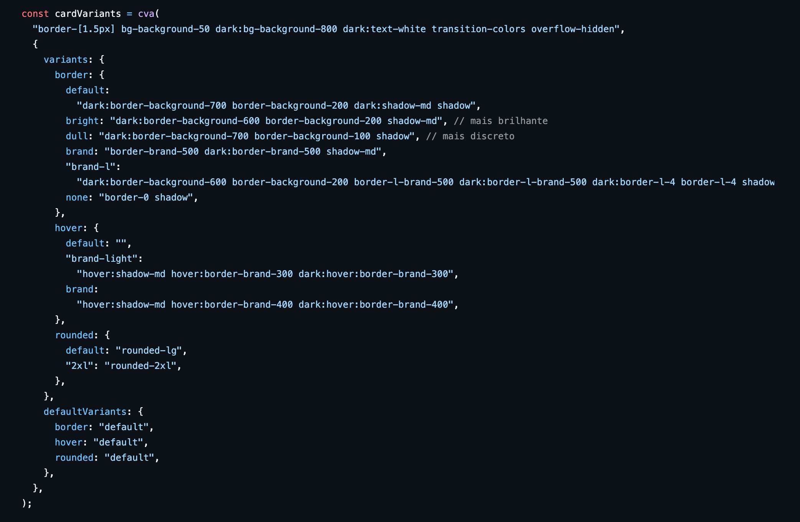
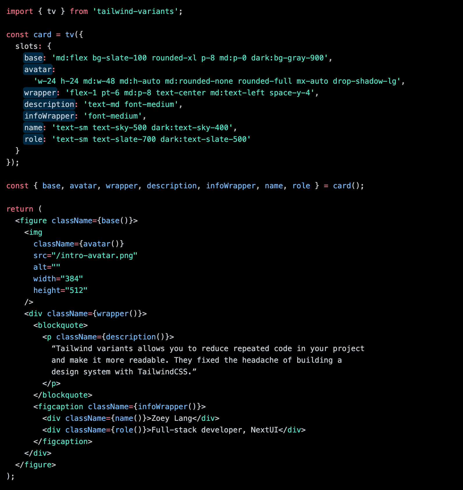

Uma outra biblioteca que também é utilizada pelo *shadcn/ui* e que pode ser utilizada com TailwindCSS ou com qualquer implementação de CSS é o [CVA - Class Variance Authority](https://cva.style/docs).

Basicamente a biblioteca traz a ideia de variantes - em que cada uma das variantes é uma sequência de classes.

Para ver o CVA em ação, dá uma olhada no [código fonte do Codante](https://github.com/codante-io/codante-io-front/blob/main/app/components/ui/cards/card/index.tsx).

### Tailwind Variants

Além do CVA, existe também o [Tailwind Variants](https://www.tailwind-variants.org/) que é ainda mais poderoso. Ao meu ver uma das vantagens dele para o CVA é que você pode usar *slots* em componentes mais complexos.

Por exemplo, para fazer esse Card:

Você pode usar esse código:

