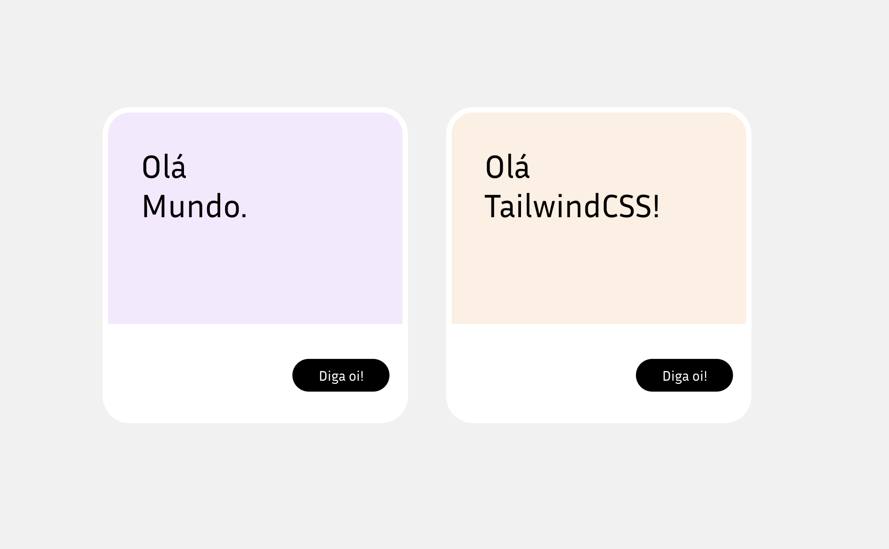

Podemos explorar de forma inicial o Tailwind usando o *Tailwind Playground*:

<https://play.tailwindcss.com>

Podemos começar por lá a entender como é que funciona esse novo framework.

## Exercício 01

Crie dois cards iguais aos que estão na imagem abaixo. Vamos usar, nesse momento, apenas o Tailwind Playground, ok?

Se preferir, o Figma está [aqui nesse link](https://www.figma.com/design/eZhlJehlg7pQNTb2ghaKmt/TailwindCSS---Exerc%C3%ADcios?node-id=1-2&m=dev&t=kDraca2deIecUPoQ-1)



E, se não souber como fazer, tudo bem. A gente ainda nem começou praticamente o workshop. Vamos resolver juntos. A ideia desse exercício é apenas você entender mais ou menos o "fluxo" de código do TailwindCSS.

### Resolução - Exercício 01

O legal do Playground também é que o código é compartilhável pela URL, então podemos enviar para qualquer pessoa aquilo que prototipamos simplesmente copiando a URL.

A resolução está [neste link](https://play.tailwindcss.com/BdP1bDxRwm).

Se você preferir código:

```html
<!-- index.html -->
<div class="flex min-h-screen items-center justify-center gap-10 bg-gray-50 font-display">
  <div class="rounded-xl bg-white shadow-lg">
    <div class="m-3 h-40 w-3xs rounded bg-purple-100 p-6 text-left">
      <h2 class="text-2xl text-gray-700">
        Olá <br />
        mundo.
      </h2>
    </div>
    <footer class="px-3 py-4 text-right">
      <button class="rounded-full bg-black px-4 py-1 text-xs text-white">Diga oi!</button>
    </footer>
  </div>
  <div class="rounded-xl bg-white shadow-lg">
    <div class="m-3 h-40 w-3xs rounded bg-orange-100 p-6 text-left">
      <h2 class="text-2xl">
        Olá <br />
        TailwindCSS
      </h2>
    </div>
    <footer class="px-3 py-4 text-right">
      <button class="rounded-full bg-black px-4 py-1 text-xs text-white">Diga oi!</button>
    </footer>
  </div>
  <div></div>
</div>
```

```css
/* tailwind.css */
@import url("https://fonts.googleapis.com/css2?family=Inria+Sans:ital,wght@0,300;0,400;0,700;1,300;1,400;1,700&display=swap");

@import "tailwindcss";

@theme {
  --font-display: "Inria Sans", cursive;
}

```
