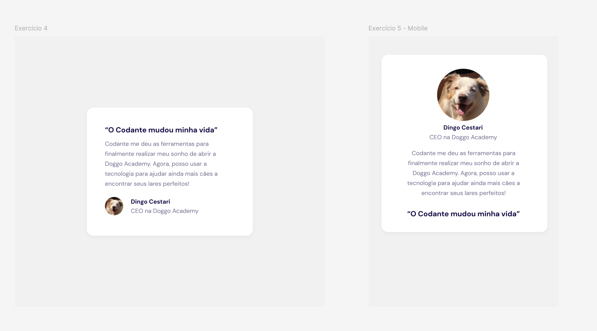

-

O mesmo card que tínhamos, vamos mudar para fazê-lo diferente dependendo do viewport (diferentes exibições para desktop e mobile.)

Vamos então iniciar esse exercício com o código final do exercício passado. A ideia é fazermos, para o mesmo card a versão desktop e versão mobile como na figura abaixo:



Para um breakpoint maior que **md**, utilize o *template desktop*. Para um breakpoint menor que **md** utilize o card versão *mobile*

Você pode também abrir diretamente no Figma para inspecionar cores e fontes.

[Link do Figma](https://www.figma.com/design/eZhlJehlg7pQNTb2ghaKmt/TailwindCSS---Exerc%C3%ADcios?node-id=3-27&m=dev&t=kDraca2deIecUPoQ-1)

### Código Inicial

O código inicial é o código final do exercício anterior

```html
<!-- exercicios/05-inicial.html -->
<!doctype html>
<html lang="en">
  <head>
    <meta charset="UTF-8" />
    <meta name="viewport" content="width=device-width, initial-scale=1.0" />
    <title>Exercício 04</title>
    <link href="../tailwind.css" rel="stylesheet" />
  </head>
  <body class="flex min-h-screen items-center justify-center bg-gray-100">
    <div class="font-display1 max-w-sm rounded-2xl bg-white p-10 shadow-2xl">
      <h3 class="text-xl font-medium text-gray-800">
        "O Codante mudou minha vida"
      </h3>
      <p class="mt-4 text-gray-500">
        Codante me deu as ferramentas para finalmente realizar meu sonho de
        abrir a Doggo Academy. Agora, posso usar a tecnologia para ajudar ainda
        mais cães a encontrar seus lares perfeitos!
      </p>
      <footer class="mt-10 flex gap-4">
        
        <div>
          <p class="font-medium text-gray-800">Dingo Cestari</p>
          <p class="text-gray-500">CEO na Doggo Academy</p>
        </div>
      </footer>
    </div>
  </body>
</html>

```

#### Resolução

A resolução proposta está abaixo:

```html
<!-- exercicios/05-final.html -->
<!doctype html>
<html lang="en">
  <head>
    <meta charset="UTF-8" />
    <meta name="viewport" content="width=device-width, initial-scale=1.0" />
    <title>Exercício 05</title>
    <link href="../tailwind.css" rel="stylesheet" />
  </head>
  <body
    class="flex min-h-screen items-center justify-center bg-gray-100 text-center md:text-left"
  >
    <div
      class="font-display1 flex max-w-sm flex-col-reverse rounded-2xl bg-white p-10 shadow-2xl md:flex-col"
    >
      <h3 class="mt-10 text-xl font-medium text-gray-800 md:mt-0">
        "O Codante mudou minha vida"
      </h3>
      <p class="mt-4 text-gray-500">
        Codante me deu as ferramentas para finalmente realizar meu sonho de
        abrir a Doggo Academy. Agora, posso usar a tecnologia para ajudar ainda
        mais cães a encontrar seus lares perfeitos!
      </p>
      <footer class="flex flex-col gap-4 md:mt-10 md:flex-row">
        
        <div>
          <p class="font-medium text-gray-800">Dingo Cestari</p>
          <p class="text-gray-500">CEO na Doggo Academy</p>
        </div>
      </footer>
    </div>
  </body>
</html>
```
